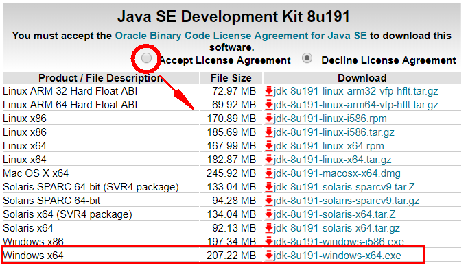
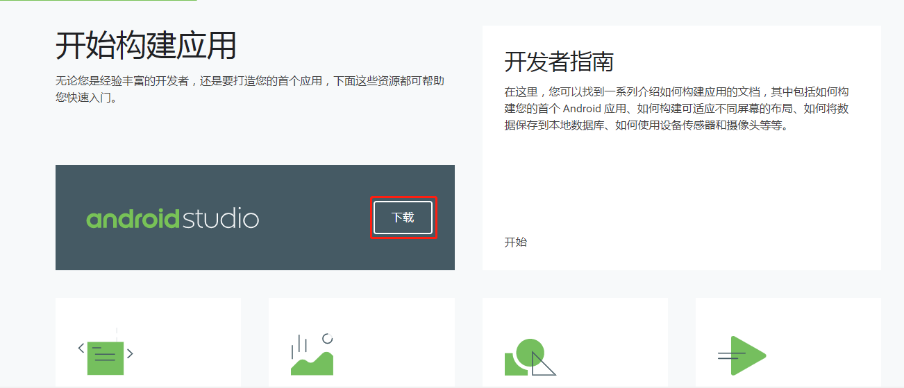
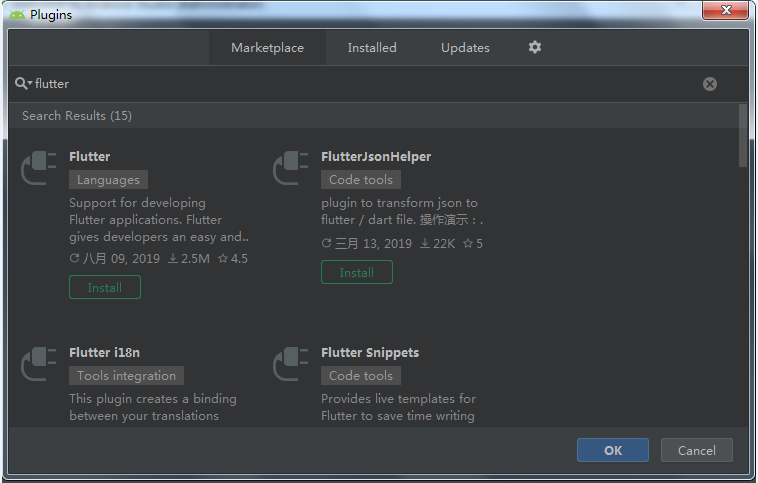
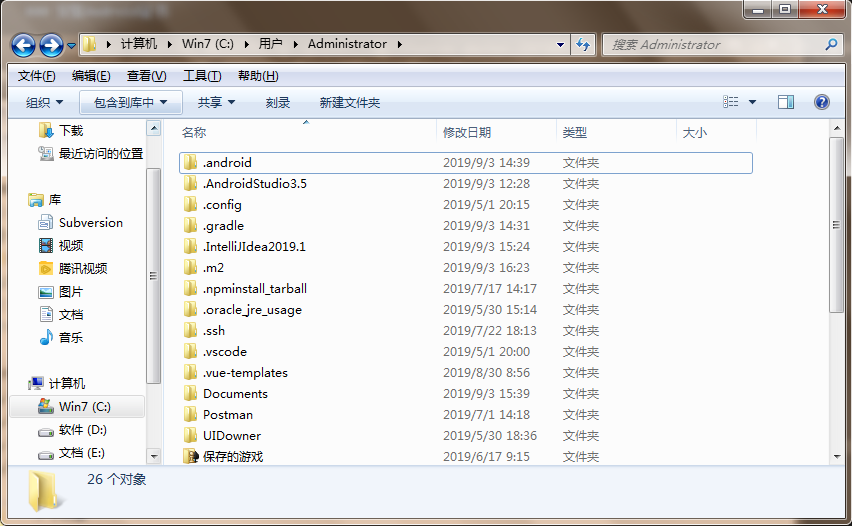
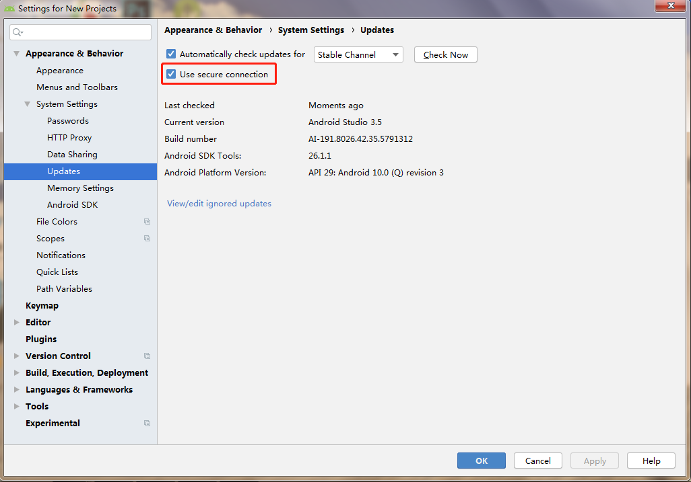

# Flutter入门

## 认识一下Flutter

**主流框架对比**

**Cordova：**个人认为Flutter可以完胜了，因为Cordova还是基于网页技术进行包装，利用插件的形式开发移动应用的，就这一点。无论是性能还是体验，Flutter都可以完胜了。

**RN（React Native）：**RN的效率由于是将View编译成了原生View,所以效率上要比基于Cordova的HTML5高很多,但是它也有效率问题,RN的渲染机制是基于前端框架的考虑,复杂的UI渲染是需要依赖多个view叠加.比如我们渲染一个复杂的ListView,每一个小的控件,都是一个native的view,然后相互组合叠加.想想此时如果我们的list再需要滑动刷新,会有多少个对象需要渲染.所以也就有了前面所说的RN的列表方案不友好。

**Flutter：**吸收了前两者的教训之后,在渲染技术上,选择了自己实现(GDI),由于有更好的可控性,使用了新的语言Dart,避免了RN的那种通过桥接器与Javascript通讯导致效率低下的问题,所以在性能方面比RN更高一筹;有经验的开发者可以打开Android手机开发者选项里面的显示边界布局,发现Flutter的布局是一个整体.说明Flutter的渲染没用使用原生控件进行渲染。

**120fps超高性能**

Flutter采用GPU渲染技术，所以性能极高。

Flutter编写的应用是可以达到120fps(每秒传输帧数),这也就是说，它完全可以胜任游戏的制作。而我们常说的RN的性能只能达到60fps，这也算是Flutter的一个超高竞争力吧。官方宣称Flutter甚至会超过原生性能。

如果你想迈入移动游戏领域，学习Flutter也是一个非常好的选择。

**Flutter生态情况**

[github地址](https://github.com/Solido/awesome-flutter)

## Flutter开发环境搭建Windows版
::: danger 警告
特别说明:如果你还不会翻墙，科学上网。那你先停止学习吧，因为你不可能安装成功，先去学学这些东西，能打开谷歌了，再返回来学效率更高。
:::
**使用镜像**

由于在国内访问Flutter有时可能会受到限制，Flutter官方为中国开发者搭建了临时镜像，大家可以将如下环境变量加入到用户环境变量中：
``` sh
export PUB_HOSTED_URL=https://pub.flutter-io.cn
export FLUTTER_STORAGE_BASE_URL=https://storage.flutter-io.cn
```
### 系统的基本要求

**操作系统:**：必须windows7以上64位操作系统。（这个一般都能很好的满足）  
**磁盘空间：**：大于3个G，虽然官方说的是400M，但是你还需要安装Android Studio 和 虚拟机，所以至少要3个G左右，如果能达到5个G就更好了（满足多个虚拟机的要求）。  
**需要Git环境**：Flutter需要git环境的支持，所以这个也要有，作为一个前端，这个是必备工具，所以我在文章中就不教大家安装了。

### JAVA环境的安装
既然要做原生应用了，而且是基于Android的，那还是需要我们安装一下JAVA环境的，我比一般得到一个新系统后首先做的就是这一步。这个就相当于你按一个软件，你不用考虑太多。

[JAVA环境下载地址](https://www.oracle.com/technetwork/java/javase/downloads/jdk8-downloads-2133151.html)

这个地址会随着Java升级有所变化，如果已经改变了，请百度搜索java下载或者直接到Java官网下载。



先点击红圈，然后根据你系统是64位还是32位选择版本，我这里是64位的，所以选择最下面的x64版本。

下载完成后进行安装，这个就直接下一步下一步就可以了。我一般都是安装到系统盘，也就是C盘。

安装完成到终端（命令行）里输入java，能出现下图中的结果，说明安装成功。


### 下载安装 FlutterSDK

1. 去官网下载Flutter安装包，[下载链接](https://flutter.io/sdk-archive/#windows)。我选择的版本是v1.7.8+hotfix.4。
2. 将安装包zip解压到你想安装Flutter SDK的路径（如： E:\fluter）；注意，不要将flutter安装到需要一些高权限的路径如C:\Program Files\，这个没必要跟我一样，凭借自己喜好设置就好）。
3. 在Flutter安装目录的flutter文件下找到flutter_console.bat，双击运行并启动flutter命令行。（此处无作用，可忽略）

**配置Flutter环境变量**

4. 右键“桌面-计算机-选择属性” -> 高级系统设置 -> 高级 -> 环境变量 -> 系统变量 -> 找到Path，点击编辑 -> 将（E:\fluter\bin;）复制上去，注意前面需要加一个英文的分号（;）。

**进行Flutter doctor 的测试**

5. 配好环境变量后，重启命令控制台，输入 “flutter doctor”，出现如下则安装配置完成。


此时注意看上图，其中第一个“√”，代表 v1.7.8+hotfix.4 已经安装完成，“!”表示还未安装。

### Android Studio的安装
1. 下载Android Studio：直接到官网进行下载就可以了。[下载链接](https://developer.android.com/)，进入后向下拉，然后看到如下界面，点击红圈处进行下载。



2. 安装Android Studio 软件：这个安装也就是差不多下一步下一步，如果你真的不会，给你个比较详细的教程。https://www.cnblogs.com/xiadewang/p/7820377.html，（需要注意的是，到下图时，会变的很慢，它去谷歌下载了很多包） 
3. 打开Android Stuido 软件，然后找到页面 Configure，点击选择 Plugins的配置，搜索Flutter插件，点击安装。（在安装Flutter插件时，会默认安装Flutter以及Dart）



安装完成后，你需要重新启动一下Android Studio软件。

同时，再次打开命令终端，输入“flutter doctor”验证是否都已安装完成。

### 安装Android证书

安装好Android Studio后，再次打开终端（命令行），输入flutter doctor,这时候的x会明显减少，但是你还是会遇到1-2个，其中有一个就是提示没有安装证书。安装证书只要在终端里执行下面的命令。
``` js
flutter doctor --android-licenses
```
然后会提示你选Y/N，不要犹豫，一律选择Y，就可以把证书安装好。（说的都是一大堆一大堆的英文，我也看不懂是啥）

到这里windows的开发环境就安装的差不多了。

### 安装Android studio时踩过的坑
1. C盘(C:\Users\Administrator)目录下无AppData文件夹，如下图所示：



解决方法：当前文件夹目录下，点击上方“工具 -> 文件夹选项 -> 查看 -> 勾选‘显示隐藏的文件、文件夹或驱动器’”。

2. 在安装Flutter插件的时候，显示安装不上

解决方法： 初始界面点击“ Configure -> 选择settings”，进入后选 “Updates -> 取消勾选 Use secure connection ”，如下图红色圈中取消勾选，然后重新Android Studio。



## Flutter开发环境搭建Mac版
**系统环境要求**

Flutter因为是新出的框架，所以对系统还是有一定的要求的。
``` sh
● MacOS （64-bit）
● 磁盘空间：大于700M，如果算上Android Studio等编辑工具，尽量大于3G。
● 命令号工具：bash、mkdir、rm、git、curl、unzip、which、brew 这些命令在都可以使用。
```
注意：一般你会在brew这个命令下载坑，很多mac系统都没有安装这个，你可以进行安装，因为这个和本知识关系性不大，所以我就不写流程了，如果你出现问题，直接点击链接学习安装就可以了。

学习安装brew：https://segmentfault.com/a/1190000013317511

### 下载Flutter SDK包

网址：https://flutter.io/setup-macos/

进入网址后，向下拖拽一下，然后看到图片中的内容，点击红框处就可以下载了。

如果你这也感觉麻烦，那可以直接点击下面的链接：

点击直接下载：https://storage.googleapis.com/flutter_infra/releases/beta/macos/flutter_macos_v0.9.4-beta.zip

这个会随着版本的升级，而失效，所以不建议使用。

### 配置环境变量
压缩包下载好以后，找个位置进行解压。这个位置很重要，因为下面配置环境变量的时候要用到。比如你配置到了根目录下的app文件夹。

1.打开终端工具（这个我就不用写了吧），使用vim进行配置环境变量，命令如下：
``` js
vim ~/.bash_profile
```
在打开的文件里增加一行代码，意思是配置flutter命令在任何地方都可以使用。
``` js
export PATH=/app/flutter/bin:$PATH
```
提示：这行命令你要根据你把压缩包解压的位置来进行编写，写的是你的路径，很有可能不跟文章一样。

配置完成后，需要用source命令重新加载一下 ，具体命令如下：
``` js
source ~/.bash_profile
```
完成这部以后，就算我们flutter的安装工作完成了，但是这还不能进行开发。可以使用命令来检测一下，是否安装完成了。
``` js
flutter -h
```
出现下面的结果，说明到目前为止，我们安装一切顺利。

### 检查开发环境
到上边为止，我们安装好了Flutter，但是还不具备开发环境。开发还需要很多软件和插件的支持，那到底需要哪些插件和软件那？我们可以使用Flutter为我们提供的命令来进行检查：
``` js
flutter doctor
```

如果你英文很好，你应该可以很容易读出上面的检测结果，有很多条目都没有通过。需要我们安装检测结果一条条进行安装，直到满足开发环境。（如果有[!]x标志，表示本行检测没有通过，就需要我们设置或者安装相应的软件了。）

有可能你的Android studio也没有安装，那么你要先安装这个编辑器，安装好后，可以顺便下载Android SDK。

Android Studio下载地址：http://www.android-studio.org/

打开后选择对应的Mac版本，如下图（随着网站的改版，可能略有不同）

下载Android SDK的时候，记得搭上梯子，否则你会等到天荒地老（祝君一切顺利）。

如果你有安装，那么第一步要作的是允许协议（android-licenses）。允许方法就是在终端运行如下命令：
``` js
flutter doctor --android-licenses
```
然后让你输入Y/N的时候，一路Y就可以了（至于啥意思，我也没仔细看，大概就和安装软件的下一步下一步是一样的，你按N是不能成功的）。

这不完成后，我们再使用flutter doctor进行检测后，会看到还是有很多x。大概如下：
``` js
  To install, run:
    brew install --HEAD libimobiledevice
    brew install ideviceinstaller
✗ ios-deploy not installed. To install:
    brew install ios-deploy
✗ CocoaPods not installed.
    CocoaPods is used to retrieve the iOS platform side's plugin code that responds to your plugin usage on the Dart side.
    Without resolving iOS dependencies with CocoaPods, plugins will not work on iOS.
    For more info, see https://flutter.io/platform-plugins
  To install:
    brew install cocoapods
    pod setup
```
其实大概意思就是我们需要这些软件，Flutter推荐你用brew命令进行安装。

我们可以直接在终端里输入下列命令（每输完一个都要等一会，等待软件包安装完成）
``` js
brew install --HEAD libimobiledevice
brew install ideviceinstaller
brew install ios-deploy
brew install cocoapods
pod setup
```

这个大问题解决以后，我们还需要为Android Studio安装一下Flutter插件（这个有可能你安装过，如果出现下面的提示，说明你还没有安装）
``` js
✗ Flutter plugin not installed; this adds Flutter specific functionality.
✗ Dart plugin not installed; this adds Dart specific functionality.
```
打开Android Stuido 软件，然后找到Plugin的配置，搜索Flutter插件。

出现上图，点中间的Search in repositories,然后点击安装。

安装完成后，你需要重新启动一下Android Studio软件。

我做到这里环境就全部OK了，只有一个没有找到调试设备了，因为我没有调试的手机硬件，所以出现这个提示,不用管它。
``` js
[!] Connected devices
    ! No devices available
```
### Pub源的配置
如果你没有梯子，一个人人都知道的原因，你还需要在环境变量里配置一下Pub源，不然你是无法进行使用的。

运行：
``` js
vim ~/.bash_profile
```
增加两行配置
``` js
export PUB_HOSTED_URL=https://pub.flutter-io.cn
export FLUTTER_STORAGE_BASE_URL=https://storage.flutter-io.cn
```
重新加载环境变量
``` js
source ~/.bash_profile
```
希望大家都能安装成功，这只是我的安装过程，不敢保证全部正确，但是我尽量详细的描述了我Mac的搭建过程，希望可以帮助到Flutter的爱好者。

## 安装AVD虚拟机 Flutter跑起来
**Android studio新建Flutter项目**

打开Andorid Studio ，会出现下面的界面，我们选择第二项，新建Flutter项目。