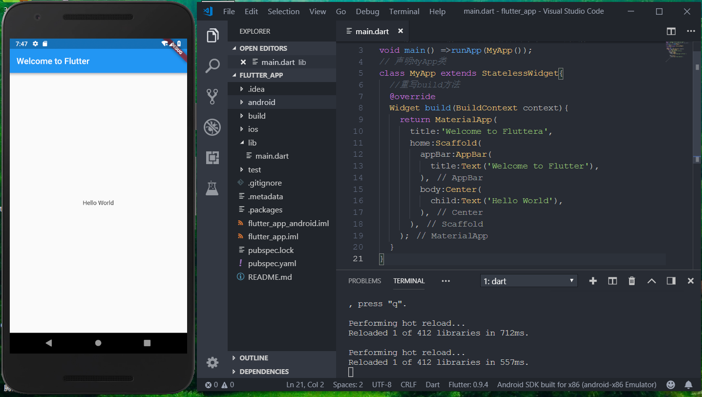

# 环境搭建
[[toc]]

## 认识一下Flutter

**主流框架对比**

**Cordova：** 个人认为Flutter可以完胜了，因为Cordova还是基于网页技术进行包装，利用插件的形式开发移动应用的，就这一点。无论是性能还是体验，Flutter都可以完胜了。

**RN(React Native)：** RN的效率由于是将View编译成了原生View,所以效率上要比基于Cordova的HTML5高很多,但是它也有效率问题,RN的渲染机制是基于前端框架的考虑,复杂的UI渲染是需要依赖多个view叠加.比如我们渲染一个复杂的ListView,每一个小的控件,都是一个native的view,然后相互组合叠加.想想此时如果我们的list再需要滑动刷新,会有多少个对象需要渲染.所以也就有了前面所说的RN的列表方案不友好。

**Flutter：** 吸收了前两者的教训之后,在渲染技术上,选择了自己实现(GDI),由于有更好的可控性,使用了新的语言Dart,避免了RN的那种通过桥接器与Javascript通讯导致效率低下的问题,所以在性能方面比RN更高一筹;有经验的开发者可以打开Android手机开发者选项里面的显示边界布局,发现Flutter的布局是一个整体.说明Flutter的渲染没用使用原生控件进行渲染。

**120fps超高性能**

Flutter采用GPU渲染技术，所以性能极高。

Flutter编写的应用是可以达到120fps(每秒传输帧数),这也就是说，它完全可以胜任游戏的制作。而我们常说的RN的性能只能达到60fps，这也算是Flutter的一个超高竞争力吧。官方宣称Flutter甚至会超过原生性能。

如果你想迈入移动游戏领域，学习Flutter也是一个非常好的选择。

**Flutter生态情况**

[github地址](https://github.com/Solido/awesome-flutter)

## 开发环境搭建Windows版
::: danger 警告
特别说明:如果你还不会翻墙，科学上网。那你先停止学习吧，因为你不可能安装成功，先去学学这些东西，能打开谷歌了，再返回来学效率更高。
:::
**使用镜像**

由于在国内访问Flutter有时可能会受到限制，Flutter官方为中国开发者搭建了临时镜像，大家可以将如下环境变量加入到用户环境变量中：
``` sh
export PUB_HOSTED_URL=https://pub.flutter-io.cn
export FLUTTER_STORAGE_BASE_URL=https://storage.flutter-io.cn
```
### 系统的基本要求

**操作系统:**：必须windows7以上64位操作系统。（这个一般都能很好的满足）  
**磁盘空间：**：大于3个G，虽然官方说的是400M，但是你还需要安装Android Studio 和 虚拟机，所以至少要3个G左右，如果能达到5个G就更好了（满足多个虚拟机的要求）。  
**需要Git环境**：Flutter需要git环境的支持，所以这个也要有，作为一个前端，这个是必备工具，所以我在文章中就不教大家安装了。

### JAVA环境的安装
既然要做原生应用了，而且是基于Android的，那还是需要我们安装一下JAVA环境的，我比一般得到一个新系统后首先做的就是这一步。这个就相当于你按一个软件，你不用考虑太多。

[JAVA环境下载地址](https://www.oracle.com/technetwork/java/javase/downloads/jdk8-downloads-2133151.html)

这个地址会随着Java升级有所变化，如果已经改变了，请百度搜索java下载或者直接到Java官网下载。


先点击红圈，然后根据你系统是64位还是32位选择版本，我这里是64位的，所以选择最下面的x64版本。

下载完成后进行安装，这个就直接下一步下一步就可以了。我一般都是安装到系统盘，也就是C盘。

安装完成到终端（命令行）里输入java，能出现下图中的结果，说明安装成功。


### 下载安装 FlutterSDK

1. 去官网下载Flutter安装包，[下载链接](https://flutter.io/sdk-archive/#windows)。我选择的版本是v1.7.8+hotfix.4。
2. 将安装包zip解压到你想安装Flutter SDK的路径（如： E:\fluter）；注意，不要将flutter安装到需要一些高权限的路径如C:\Program Files\，这个没必要跟我一样，凭借自己喜好设置就好）。
3. 在Flutter安装目录的flutter文件下找到flutter_console.bat，双击运行并启动flutter命令行。（此处无作用，可忽略）

**配置Flutter环境变量**

4. 右键“桌面-计算机-选择属性” -> 高级系统设置 -> 高级 -> 环境变量 -> 系统变量 -> 找到Path，点击编辑 -> 将（E:\fluter\bin;）复制上去，注意前面需要加一个英文的分号（;）。

**进行Flutter doctor 的测试**

5. 配好环境变量后，重启命令控制台，输入 “flutter doctor”，出现如下则安装配置完成。


此时注意看上图，其中第一个“√”，代表 v1.7.8+hotfix.4 已经安装完成，“!”表示还未安装。

### Android Studio的安装
1. 下载Android Studio：直接到官网进行下载就可以了。[下载链接](https://developer.android.com/)，进入后向下拉，然后看到如下界面，点击红圈处进行下载。


2. 安装Android Studio 软件：这个安装也就是差不多下一步下一步，如果你真的不会，给你个比较详细的教程。https://www.cnblogs.com/xiadewang/p/7820377.html，（需要注意的是，到下图时，会变的很慢，它去谷歌下载了很多包） 
3. 打开Android Stuido 软件，然后找到页面 Configure，点击选择 Plugins的配置，搜索Flutter插件，点击安装。（在安装Flutter插件时，会默认安装Flutter以及Dart）


安装完成后，你需要重新启动一下Android Studio软件。

同时，再次打开命令终端，输入“flutter doctor”验证是否都已安装完成。

### 安装Android证书

安装好Android Studio后，再次打开终端（命令行），输入flutter doctor,这时候的x会明显减少，但是你还是会遇到1-2个，其中有一个就是提示没有安装证书。安装证书只要在终端里执行下面的命令。
``` js
flutter doctor --android-licenses
```
然后会提示你选Y/N，不要犹豫，一律选择Y，就可以把证书安装好。（说的都是一大堆一大堆的英文，我也看不懂是啥）

到这里windows的开发环境就安装的差不多了，此时，我们再次打开终端，然后输入“flutter doctor”验证，如果出现下图，则表示都安装成功了。


### 安装Android studio时踩过的坑
1. C盘(C:\Users\Administrator)目录下无AppData文件夹，如下图所示：


解决方法：当前文件夹目录下，点击上方“工具 -> 文件夹选项 -> 查看 -> 勾选‘显示隐藏的文件、文件夹或驱动器’”。

2. 在安装Flutter插件的时候，显示安装不上

解决方法： 初始界面点击“ Configure -> 选择settings”，进入后选 “Updates -> 取消勾选 Use secure connection ”，如下图红色圈中取消勾选，然后重新Android Studio。


## 开发环境搭建Mac版
**系统环境要求**

Flutter因为是新出的框架，所以对系统还是有一定的要求的。
``` sh
● MacOS （64-bit）
● 磁盘空间：大于700M，如果算上Android Studio等编辑工具，尽量大于3G。
● 命令号工具：bash、mkdir、rm、git、curl、unzip、which、brew 这些命令在都可以使用。
```
注意：一般你会在brew这个命令下载，很多mac系统都没有安装这个，你可以进行安装，因为这个和本知识关系性不大，所以我就不写流程了，如果你出现问题，直接点击链接学习安装就可以了。

学习安装brew：https://segmentfault.com/a/1190000013317511

### 下载Flutter SDK包

[网址](https://flutter.io/setup-macos/)

进入网址后，向下拖拽一下，然后看到图片中的内容，点击红框处就可以下载了。

如果你这也感觉麻烦，那可以直接点击下面的链接：

[点击直接下载flutter_macos_v0.9.4-beta.zip](https://storage.googleapis.com/flutter_infra/releases/beta/macos/flutter_macos_v0.9.4-beta.zip)

这个会随着版本的升级，而失效，所以不建议使用。

### 配置环境变量
压缩包下载好以后，找个位置进行解压。这个位置很重要，因为下面配置环境变量的时候要用到。比如你配置到了根目录下的app文件夹。

1.打开终端工具（这个我就不用写了吧），使用vim进行配置环境变量，命令如下：
``` js
vim ~/.bash_profile
```
``` warning
注意：
字母O：只读，字母E：需改，字母Q：退出，
按e进入编辑，先输入字母i才能编辑，编辑完之后先按esc退出，然后输入:wq(保存并退出)，:q是直接退出。
```
在打开的文件里增加一行代码，意思是配置flutter命令在任何地方都可以使用（把文件夹按住左键拖入到终端可以获取路径）。
``` js
export PATH=/Users/xiaoyang/Documents/flutter/bin:$PATH
```
提示：这行命令你要根据你把压缩包解压的位置来进行编写，写的是你的路径，很有可能不跟文章一样（目前flutter文件放在用户的文稿当中）。

配置完成后，需要用source命令重新加载一下 ，具体命令如下（作用：重启终端）：
``` js
source ~/.bash_profile
```
完成这部以后，就算我们flutter的安装工作完成了，但是这还不能进行开发。可以使用命令来检测一下，是否安装完成了。
``` js
flutter doctor
```
出现下面的结果，说明到目前为止，我们安装一切顺利(或者输入 flutter -h来检查安装都行)。


### 检查开发环境
到上边为止，我们安装好了Flutter，但是还不具备开发环境。开发还需要很多软件和插件的支持，那到底需要哪些插件和软件那？我们可以使用Flutter为我们提供的命令来进行检查：
``` js
flutter doctor
```

如果你英文很好，你应该可以很容易读出上面的检测结果，有很多条目都没有通过。需要我们安装检测结果一条条进行安装，直到满足开发环境。（如果有[!]x标志，表示本行检测没有通过，就需要我们设置或者安装相应的软件了。）

有可能你的Android studio也没有安装，那么你要先安装这个编辑器，安装好后，可以顺便下载Android SDK。

[Android Studio下载地址](http://www.android-studio.org/)

打开后选择对应的Mac版本，如下图（随着网站的改版，可能略有不同）

下载Android SDK的时候，记得搭上梯子，否则你会等到天荒地老（祝君一切顺利）。

如果你有安装，那么第一步要作的是允许协议（android-licenses）。允许方法就是在终端运行如下命令：
``` js
flutter doctor --android-licenses
```
然后让你输入Y/N的时候，一路Y就可以了（至于啥意思，我也没仔细看，大概就和安装软件的下一步下一步是一样的，你按N是不能成功的）。

这不完成后，我们再使用flutter doctor进行检测后，会看到还是有很多x。大概如下：
``` js
  To install, run:
    brew install --HEAD libimobiledevice
    brew install ideviceinstaller
✗ ios-deploy not installed. To install:
    brew install ios-deploy
✗ CocoaPods not installed.
    CocoaPods is used to retrieve the iOS platform side's plugin code that responds to your plugin usage on the Dart side.
    Without resolving iOS dependencies with CocoaPods, plugins will not work on iOS.
    For more info, see https://flutter.io/platform-plugins
  To install:
    brew install cocoapods
    pod setup
```
其实大概意思就是我们需要这些软件，Flutter推荐你用brew命令进行安装。

我们可以直接在终端里输入下列命令（每输完一个都要等一会，等待软件包安装完成）
``` js
brew install --HEAD libimobiledevice
brew install ideviceinstaller
brew install ios-deploy
brew install cocoapods
pod setup
```

这个大问题解决以后，我们还需要为Android Studio安装一下Flutter插件（这个有可能你安装过，如果出现下面的提示，说明你还没有安装）
``` js
✗ Flutter plugin not installed; this adds Flutter specific functionality.
✗ Dart plugin not installed; this adds Dart specific functionality.
```
打开Android Stuido 软件，然后找到Plugin的配置，搜索Flutter插件。

出现上图，点中间的Search in repositories,然后点击安装。

安装完成后，你需要重新启动一下Android Studio软件。

我做到这里环境就全部OK了，只有一个没有找到调试设备了，因为我没有调试的手机硬件，所以出现这个提示,不用管它。
``` js
[!] Connected devices
    ! No devices available
```
### Pub源的配置
如果你没有梯子，一个人人都知道的原因，你还需要在环境变量里配置一下Pub源，不然你是无法进行使用的。

运行：
``` js
vim ~/.bash_profile
```
增加两行配置
``` js
export PUB_HOSTED_URL=https://pub.flutter-io.cn
export FLUTTER_STORAGE_BASE_URL=https://storage.flutter-io.cn
```
重新加载环境变量
``` js
source ~/.bash_profile
```
希望大家都能安装成功，这只是我的安装过程，不敢保证全部正确，但是我尽量详细的描述了我Mac的搭建过程，希望可以帮助到Flutter的爱好者。

附件： (MAC环境配置)
``` js
// flutter文件所在位置
export PATH=/Users/xiaoyang/Documents/flutter/bin:$PATH
// flutter中Android的sdk所在位置及其工具配置
export ANDROID_HOME="/Users/xiaoyang/Library/Android/sdk"
export PATH=${PATH}:${ANDROID_HOME}/tools
export PATH=${PATH}:${ANDROID_HOME}/platform-tools
//fluter国内镜像
export PUB_HOSTED_URL=https://pub.flutter-io.cn
export FLUTTER_STORAGE_BASE_URL=https://storage.flutter-io.cn
// Android studio的sdk所在位置及其工具配置
export ANDROID_HOMES=$HOME/Library/Android/sdk
export PATH=$PATH:$ANDROID_HOMES/emulator
export PATH=$PATH:$ANDROID_HOMES/tools
export PATH=$PATH:$ANDROID_HOMES/tools/bin
export PATH=$PATH:$ANDROID_HOMES/platform-tools
```
## 安装AVD虚拟机 Flutter跑起来
**Android studio新建Flutter项目**

打开Andorid Studio ，会出现下面的界面，我们选择第二项，新建Flutter项目。如图所示：


（如果你第一次新建项目，可能会有些慢。）

打开第二个窗口后，选择第一个选项Flutter Application(flutter应用)。


这步完成后，系统就会自动为我们创建一个Flutter项目（新建项目的过程也是很慢的，它要去谷歌下载gradle，这个东西很容下载失败，如果失败，可以多反复试几次）。


如果你到了这一步，坚持住，马上成功了。

### 安装AVD虚拟机

1. 现在需要一个虚拟机来运行我们的程序，可以点击Android Studio中的上方菜单tool -AVD Manager选项或者点击如下图所示红色圈中，选择AVD Manager。


2. 出现新建菜单，选择Create Virtual Device.....,如果你一个虚拟机也没建过，可以点击左下角进行安装、创建虚拟机，目前图示上以安装三个版本虚拟机。


### 让Flutter跑起来
具体操作步骤如下：

1. 打开Android Studio，引入项目文件
2. 打开虚拟机，操作步骤如下图所以，先点击图一按钮，然后选择一款虚拟机，点击图二按钮

图一：


图二：


3. 待模拟器启动完成，然后点击运行按钮，如下图三所以，最后出现图四，则运行成功

图三：


图四：


出现上图，则代表Flutter项目搭建完成。

## VSCode下如何玩转Flutter

### VSCode安装Flutter插件
打开VSCode的Flutter插件界面，然后用在搜索框中输入Flutter,第一个就是Flutter插件了。点击install就可以进行安装了（具体看下图）。


安装完成后，是需要重启VSCode的。有的小伙伴肯定会问用不用装Dart插件，其实是用装的，只不过安装完Flutter插件后，Dart也为我们安装好了，不用我们自己安装。

这时候已经可以编写Flutter程序了，但是还没有预览的地方，也就是虚拟机没有开启。

### 一条命令快速开启虚拟机
现在想开启虚拟机需要打开Android Studio,然后再打开AVD虚拟机，我的电脑足足要等2分钟左右(土豪电脑除外)，我反正是不能接受的，一点不符合极客精神。下面就用一条命令，或者说制作一个批处理文件，来直接开启AVD虚拟机，这样就不用再等两分钟来开启Android Studio了。

**开启虚拟机需要两个步骤：**

1. 打开emulator.exe这个程序，你可以巧妙利用windows的查找工具进行查找。
2. 打开你设置的虚拟机，批处理时需要填写你设置的虚拟机名称。
具体步骤如下：

新建一个xxx.bat文件到桌面，xxx的意思是，你可以自己取名字，随意叫什么都可以。我这里叫EmulatorRun.bat.
查找emulator.exe文件的路径，把查找到的路径放到bat文件中（如图）。 

**默认路径为：(C:\Users\Administrator\AppData\Local\Android\Sdk\emulator)**

一般会查找到两个emulator.exe文件，一个是在tools目录下，一个是在emulator目录下，我们选择emulator目录下的这个,复制它的路径。
``` js
C:\Users\Administrator\AppData\Local\Android\Sdk\emulator\emulator.exe
```
(特别说明，你的和我的很有可能不一样，你要复制i电脑中的路径，不要复制这里的代码)

3. 打开Android Studio，并查看你的AVD虚拟机名称（如图所示）。 


如果你觉的输入不方便和怕出错，你可以点击图片右边的笔型按钮，进入编辑模式，复制这个名称。 

4. 然后根据你复制的名称，把bat文件输入成如下形式。
``` js
C:\Users\Administrator\AppData\Local\Android\Sdk\emulator\emulator.exe -netdelay none -netspeed full -avd Nexus_5X_API_29
```
5. 进行保存后双击bat文件，就可以迅速打开虚拟机了。

参数解释：
``` sh
-netdelay none :设置模拟器的网络延迟时间，默认为none，就是没有延迟。
-netspeed full: 设置网络加速值，full代表全速。
```
### 在VSCode中直接打开虚拟机
在安装了Flutter和Dart插件以后，在VSCode的右下角显示No Devices,我们直接点击它，就会显示我们电脑中安装的虚拟机，如果你电脑上没有，也可以进行安装。


### flutter run 开启预览
现在模拟器也有了，VSCode也支持Flutter开发了.现在可以在VSCode中直接打开终端，快捷键是ctrl+~，然后在终端中输入下面的命令。
``` js
flutter run
```


到此处，终于搭建出了适合前端程序员的开发环境。

## 写一个HelloWorld程序
环境搭建好后，按照惯例就是写一个HelloWorld程序，

**HelloWorld整体代码**

先快速写一个最简单的结构体，这个界面只包含两部分，头部订单的蓝色bar条和屏幕中间区域的内容。（请看下面代码）

这段代码写在根目录\lib\main.dart文件中，这就是Flutter主文件。
``` js
import 'package:flutter/material.dart';
//主函数（入口函数），下面我会简单说说Dart的函数
void main() =>runApp(MyApp());
// 声明MyApp类
class MyApp extends StatelessWidget{
  //重写build方法
  @override
  Widget build(BuildContext context){
    //返回一个Material风格的组件
   return MaterialApp(
      title:'Welcome to Flutteraa',
      home:Scaffold(
        //创建一个Bar，并添加文本
        appBar:AppBar(
          title:Text('Welcome to Flutter'),
        ),
        //在主体的中间区域，添加一个hello world 的文本
        body:Center(
          child:Text('Hello World'),
        ),
      ),
    );
  }
}
```
写完后打开终端，运行flutter run,等待一小会，就会看到虚拟机中显示了Hello World的内容。



也许你对上面的语法还不够了解，但你不必惊慌，我们会一点点进行说明，那先来看一下Dart中的函数。

### Dart语法Function函数
Dart是面向对象的语言，即使是函数也是对象，并且属于Function类型的对象。这意味着函数可以分配给变量或作为参数传递给其他函数。当然你也可以像JavaScript一样，调用一个函数。

比如我们写Hello World中的第2行，就是一个函数。
``` js
void main() =>runApp(MyApp());
```
因为这个函数体里只有一行代码，所以可以直接使用=>来省略{}，只有函数体里只有一行时，才可以使用，否则请使用大括号。

（ps:学习Dart语法时你要记住一条，Dart里一切皆对象，包括数字和函数.......,没对象的程序员小哥哥可要抓紧学习了，程序中自有颜如玉的时代到了）

### StatefulWidget和StatelessWidget

StatefulWidget ： 具有可变状态的窗口部件，也就是你在使用应用的时候就可以随时变化，比如我们常见的进度条，随着进度不断变化。
StatelessWidget：不可变状态窗口部件，也就是你在使用时不可以改变，比如固定的文字（写上后就在那里了，死也不会变了）。
这个HelloWorld代码就继承了不可变窗口部件StatelessWidget。

### VSCode中如何热加载

用VSCode编写Flutter不好的一点就是要手动加载更新应用，个人感觉这至少会降低10%的工作效率。

当我们运行flutter run以后，会有一段红色文字的提示，说明了我们可以作的事情。
``` js
To hot reload changes while running, press "r". To hot restart (a
nd rebuild state), press "R".
An Observatory debugger and profiler on Android SDK built for x86 is
available at: http://127.0.0.1:64590/
You can dump the widget hierarchy of the app (debugDumpApp) by pressing "w".
To dump the rendering tree of the app (debugDumpRenderTree), press "t".
For layers (debugDumpLayerTree), use "L"; for accessibility (debugDumpSemantics), use "S" (for traversal order) or "U" (for inverse hit test order).
To toggle the widget inspector (WidgetsApp.showWidgetInspectorOverride), press "i".
To toggle the display of construction lines (debugPaintSizeEnabled),
press "p".
To simulate different operating systems, (defaultTargetPlatform), press "o".
To display the performance overlay (WidgetsApp.showPerformanceOverlay), press "P".
To save a screenshot to flutter.png, press "s".
To repeat this help message, press "h". To detach, press "d"; to quit, press "q".
```
我们来看几个重点的：
``` sh
r 键：点击后热加载，也就算是重新加载吧。
p 键：显示网格，这个可以很好的掌握布局情况，工作中很有用。
o 键：切换android和ios的预览模式。
q 键：退出调试预览模式。
常用的一般就这些，剩下的命令以后碰到我们再进行讲解。
```

如果你觉的这太麻烦了，我们可以开启Debug模式，这时就可以实现真正的热加载了（我们保存，效果立即就会改变），但有时报错也挺烦人的。（下图时Debug模式）


