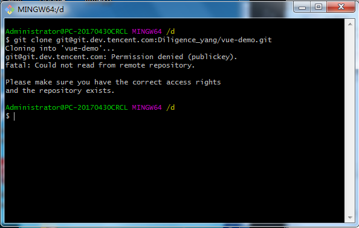
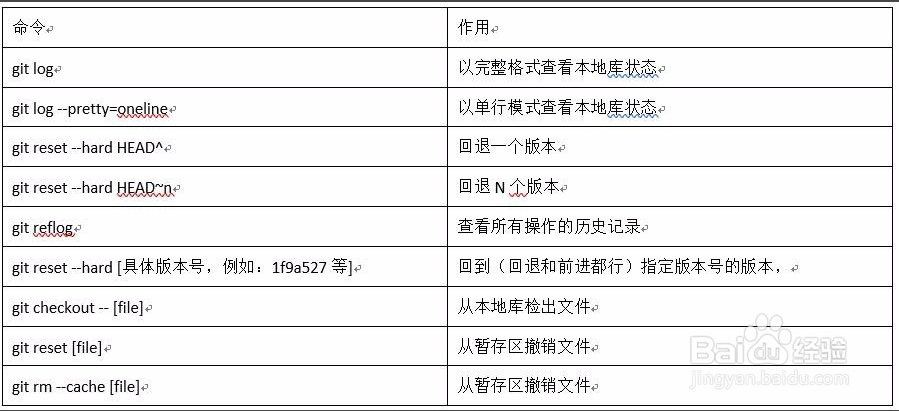

# Git

查看全局安装命令：
``` js
npm list -g --depth=0
```

## Git下载
[Git 官网](https://git-scm.com/)

> git 初次运行前的配置
``` js
// 配置用户名和邮箱
$ git config --global user.name "John Doe"
$ git config --global user.email johndoe@example.com
```

## 分布式版本控制系统
> Git是一个免费的开源 分布式版本控制系统，旨在快速高效地处理从小型到大型项目的所有事务。Git 易于学习， 占地面积小，具有闪电般快速的性能。它超越了Subversion，CVS，Perforce和ClearCase等SCM工具，具有廉价本地分支，便捷的临时区域和 多个工作流程等功能。

Git代码托管平台：国外平台（Github、Gitlab、BitBucket）、国内平台（Gitee<码云>、Coding<码市>、开源中国等）

## 多网站配置公钥

当我们参与的项目相对较多时，可能需要一台电脑与多个代码托管平台进行**关联**，然而具体操作步骤如下：(基于git 的代码托管平台，一般都支持https和ssh两种身份验证方式，使用**https方式**比较灵活，随看随下，但是每次提交代码都需要验证账户和密码，并且在推送代码过程中不能推送大型文件；而**ssh**相比较而言，省去每次推送代码验证账户和密码的步骤，并且支持推送大型文件。)

### 第一种方法(常用)
1. 生成公钥
任何目录下输入下行命令 ，然后 回车，一直回车到结束命令。
``` js
ssh-keygen -t rsa -C xxxxx@qq.com // （xxxxx@qq.com是账号邮箱地址）
```
2. 将服务器与地址建立关联
在 .ssh 目录下生成 config 文件（命令窗口输入命令：touch config），并在config 文件下编写如下代码：(目录：C:\Users\Administrator\.ssh)
``` js
Host github.com // Host 跟地址
User dajun // User 用户名，可随便输入
PreferredAuthentications publickey // 固定行
IdentityFile ~/.ssh/id_rsa_github // github 要与上面在ssh-keygen的时候输入的名字相对应
```
3. 进入网址配置公钥，将.ssh下的id_rsa_gitee.pub复制到对应网站上，建立连接
4. 克隆，拉取代码
### 注意事项
当我们在配置Host地址的时候，有可能出现地址不匹配的情况，比如：配置coding，地址就不是网上说的"git.coding.net"，此时我们可以采取以下的方式或者地址:

1. 终端直接拉取代码
``` js
git clone git@git.dev.tencent.com:Diligence_yang/vue-demo.git // 后面跟的是一串库的地址
```
2. 从以下图中获取到地址为：git.dev.tencent.com



3. 进行配置

**常用配置**：
``` js
Host gitee.com // 码云
User dajun
PreferredAuthentications publickey
IdentityFile ~/.ssh/id_rsa_gitee

Host github.com // Github
User dajun
PreferredAuthentications publickey
IdentityFile ~/.ssh/id_rsa_github

Host git.dev.tencent.com // Coding
User dajun
PreferredAuthentications publickey
IdentityFile ~/.ssh/id_rsa_conding

Host 119.3.143.198 // 公司代码库
User dajun
PreferredAuthentications publickey
IdentityFile ~/.ssh/id_rsa_bucket
```
### 代码回退



### 第二种方法
``` js
步骤：
1. 生成公钥
任何目录下输入 ssh-keygen ，回车，然后输入地址加 “文件名”，如“/c/Users/Administrator/.ssh/id_rsa_github”，回车(两次)；
生成的 .ssh 文件下，打开公钥文件，修改最后信息为自己邮箱地址,打开网址，将公钥粘贴到指定位置。(切记要修改为自己的邮箱)
2. 将服务器与地址建立关联
在 .ssh 目录下生成 config 文件（命令窗口输入命令：touch config），并在config 文件下编写如下代码：
Host github.com
User dajun
PreferredAuthentications publickey
IdentityFile ~/.ssh/id_rsa_github
注意：其中，“github.com”、“dajun”、“~/.ssh/id_rsa_github”，是需要修改的。
“github.com”：代码托管平台网址；
“dajun”：用户名；
“~/.ssh/id_rsa_github”：文件目录地址文件，其中具体路径为：C:\Users\Administrator\.ssh。
3. 克隆
注：如建立多个托管平台，则需重复上述步骤。
```
## Git常用命令

> 对于原有仓库代码进行处理

``` js
1. 克隆代码(克隆已有仓库)
2. 在对应的文件夹中添加新有项
git status
3. 提交
git add mmm.sss // mmm为文件名称，sss为文件拓展名（常用git add . 或者 git add -A，其中git add -A比git add .权限更大）
git commit -m "hhh" // hhh为git commit 提交信息，是对这个提交的概述（message，输入一个引号后按“回车”，可设置多行）
4. 日志查看
git log // 用于查看提交日志
git diff // 查看已更新的内容 
5. 更新
git push origin xxx // xxx为分支名，将自己的分支提交到远程仓库，并更新GitHub上的仓库
``` 
> 用git创建本地仓库

``` js
mkdir nnn // 创建文件夹，nnn为仓库名
cd hhh
git init // 初始化仓库
git status // 查看仓库状态
touch README.md // 创建READEME.md文件
git add ERADME.md // 添加ERADME.md至暂存区
git commit -m "hhh" // 如果想要提交信息记录的更详细，请不要加 -m
git log --pretty=short // 加--pretty=short 只显示提交信息的第一行
git log ggg // ggg是指指定的文件或目录，用于查看指定的目录、文件的日志
git log -p // 查看提交所带来的改动
git log -p ggg // 查看指定文件的改动
git diff // 可以查看工作树，暂存区，最新提交之间的差别
git diff HEAD // 查看工作树与最新提交的差别
```

## 分支操作
``` js
git branch // 显示分支一览表，同时确认当前所在的分支
git checkout -b aaa // 创建名为aaa的分支，并且切换到aaa分支
git branch aaa // 创建名为aaa的分支
git checkout aaa // 切换到aaa分支，能和git branch -b aaa 得到同样的效果
git checkout - // 切换到上一分支
git log --graph // 以图表形式查看分支
```