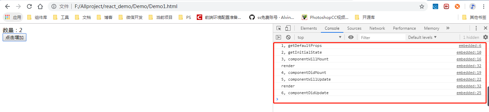

# React基础
## React介绍

**React简介:**

React起源于Facebook的内部项目，该公司积极尝试引入HTML5技术用来架设Instagram网站，开发中发现HTML5的性能下降明显，达不到预期的效果。他们就自己开发了React框架。

[ReactJS官方地址](https://facebook.github.io/react/)   

[GitHub地址](https://github.com/facebook/react)   

**react特点：**
1. 虚拟DOM: React也是以数据驱动的，每次数据变化React都会扫码整个虚拟DOM树，自动计算与上次虚拟DOM的差异变化，然后针对需要变化的部分进行实际的浏览器DOM更新。
2. 组件化： React可以从功能角度横向划分，将UI分解成不同组件，各组件都独立封装，整个UI是由一个个小组件构成的一个大组件，每个组件只关系自身的逻辑，彼此独立。
3. 单项数据流：React设计者认为数据双向绑定虽然便捷，但在复杂场景下副作用也是很明显，所以React更倾向于单向的数据流动-从父节点传递到子节点。（使用ReactLink也可以实现双向绑定，但不建议使用）

## 环境搭建和HelloWorld程序
如果不考虑工程化的问题，React的运行基础环境非常简单，只需要在HTML文件中引入两个js文件（react.min.js和react-dom.min.js）即可开始工作
**搭建开发环境**

下载所需文件

首先我们访问https://facebook.github.io/react/,在页面中单击网页左上角的React版本（课程录制时是v15.6.1）。点击后下载两个文件。

1. react.js：实现React核心逻辑，且于具体的渲染引擎无关，从而可以跨平台公用。如果应用要迁移到React Native，这一部分逻辑是不需要改变的。
2. react-dom.js：包含了具体的DOM渲染更新逻辑，以及服务端渲染的逻辑，这部分就是与浏览器相关的部分了。
``` js
// Hello World程序
<!DOCTYPE html>
<html lang="en">
    <head>
        <meta charset="UTF-8">
        <meta name="viewport" content="width=device-width, initial-scale=1.0">
        <meta http-equiv="X-UA-Compatible" content="ie=edge">
        <title>Document</title>
    </head>
    <body>
        <div id="reactContainer"></div>
        <script src="./common/react.js"></script>
        <script src="./common/react-dom.js"></script>
        <script>
            var HelloComponent = React.createClass({
                render: function() {
                    return React.createElement('h1',null,'Hello world');
                    // React.createElement()里面有多个参数，其中，前两个标签内容固定，第一个参数代表“标签”，第二个参数代表“标签内的内容”，为空则为填写null，有值则为对象，以后的参数代表“双标签内部的内容”，多个以逗号隔开。
                }
            });
    
            ReactDOM.render(
                React.createElement(HelloComponent,null),
                document.getElementById('reactContainer')
            )
        </script>
    </body>
</html>
```
**React.createClass**

它的作用是注册一个组件类HelloComponent,这个组件类只包含一个render函数，该函数通过调用React.createElement实现了以下HTML内容：
``` js
<h1>Hello world</h1>
```

**ReactDOM.render()**

ReactDOM.render是React的最基本方法，用于将模板转为HTML语言，并插入指定的DOM节点。

## 初识JSX语法
JSX即Javascript XML，它使用XML标记来创建虚拟DOM和声明组件。第02节的HelloWorld程序从本质上能完成所有的工作。只是有一些开发效率问题，比如JavaScript代码与标签混写在一起、缺乏模板支持等。而使用JSX，则可以有效解决这些问题。

**加入JSX语法支持**

如果要使用JSX语法的支持，你可以使用Babel来进行转换，但是为了讲解方便我们这里直接引入Babel的核心文件 browser.min.js。你可以去网上提供的静态资源库引用（http://www.bootcdn.cn/），也可以自己下载。

**重写HelloWorld**
``` js
<!DOCTYPE html>
<html lang="en">
<head>
    <meta charset="UTF-8">
    <meta name="viewport" content="width=device-width, initial-scale=1.0">
    <meta http-equiv="X-UA-Compatible" content="ie=edge">
    <title>Document</title>
    <script src="./common/react.js"></script>
    <script src="./common/react-dom.js"></script>
    <script src="http://cdn.bootcss.com/babel-core/5.8.38/browser.min.js"></script>
</head>
<body>
    <div id="reactContainer"></div>
    // 注意要写上type="text/babel"
    <script type="text/babel">
        var HelloComponent =React.createClass({
            render:function(){
                return <h1>Hello {this.props.name?this.props.name:'world'}</h1>;
            }
        });
 
        ReactDOM.render(
            <HelloComponent name="jspang" />,
            document.getElementById('reactContainer')
        )
    </script>
</body>
</html>
```
::: danger 注意
需要注意的是表达式不支持if…else这样的语句，但是支持三元运算符和二元运算符。
:::

## React组件：state成员
> React组件可以把它看作带有props属性集合和state状态集合并且构造出一个虚拟DOM结构的对象。

1. state成员

组件总是需要和用户互动的。React的一大创新，就是将界面组件看成一个状态机，用户界面拥有不同状态并根据状态进行渲染输出，用户界面和数据始终保持一致。开发者的主要工作就是定义state，并根据不同的state渲染对应的用户界面。

2. setState( )

通知React组件数据发生变化的方法是调用成员函数setState(data,callback)。这个函数会合并data到this.state,并重新渲染组件。渲染完成后，调用可选的callback回调。（大部分情况下不需要调用回调，因为React会负责把界面更新到最新状态）

## React组件：props和render成员
> props是组件固有属性的集合，其数据由外部传入，一般在整个组件的生命周期中都是只读的。属性的初识值通常由React.createElement函数或者JSX中标签的属性值进行传递，并合并到组件实例对象的this.props中。

props与state的区别

1. props不能被其所在的组件修改，从父组件传递进来的属性不会在组件内部更改；state只能在所在组件内部更改，或在外部调用setState函数对状态进行间接修改。

2. render成员函数 首先说render是一个函数，它对于组件来说，render成员函数是必需的。render函数的主要流程是检测this.props和this.state,再返回一个单一组件实例。

3. render函数应该是纯粹的，也就是说，在render函数内不应该修改组件state，不读写DOM信息，也不与浏览器交互。如果需要交互，应该在生命周期中进行交互。

## React组件：生命周期
> 一个组件完整的生命周期包含实例化阶段、活动阶段、销毁阶段三个阶段。每个阶段又由相应的方法管理。


过程中涉及三个主要的动作术语：

● mounting:表示正在挂接虚拟DOM到真实DOM。
● updating:表示正在被重新渲染。
● unmounting:表示正在将虚拟DOM移除真实DOM。
``` js
<!DOCTYPE html>
<html lang="en">
<head>
    <meta charset="UTF-8">
    <meta name="viewport" content="width=device-width, initial-scale=1.0">
    <meta http-equiv="X-UA-Compatible" content="ie=edge">
    <title>Document</title>
</head>
<body>
    <div id="reactContainer"></div>
    <script src="./common/react.js"></script>
    <script src="./common/react-dom.js"></script>
     <script src="./common/browser.min.js"></script>
    <script type="text/babel">
        var HelloComponent = React.createClass({
            getDefaultProps: function() {
                console.log('1, getDefaultProps')
                return {}
            },
            getInitialState: function() {
                console.log('2, getInitialState')
                return {
                    count: 1
                }
            },
            componentWillMount: function() {
                console.log('3, componentWillMount')
            },
            componentDidMount: function() {
                console.log('4, componentDidMount')
            },
            componentWillUpdate: function() {
                console.log('5, componentWillUpdate')
            },
            componentDidUpdate: function() {
                console.log('6, componentDidUpdate')
            },
            HandleClick: function(event){
                this.setState({
                    count: this.state.count + 1
                })
            },
            render: function() {
                console.log('render')
                return <div>
                        <div>数量：{this.state.count}</div>
                        <button onClick={this.HandleClick}>点击增加</button>
                    </div>
            }
        })

        ReactDOM.render(
            React.createElement(HelloComponent, null),
            document.getElementById('reactContainer')
        )
    </script>
</body>
</html>
```
输出后的打印结果如下：



## React组件：this.props.children
> this.props对象的属性与组件的属性一一对应，但有一个例外，就是this.props.children属性。它表示组件的所有子节点。
``` js
<!DOCTYPE html>
<html lang="en">
<head>
    <meta charset="UTF-8">
    <meta name="viewport" content="width=device-width, initial-scale=1.0">
    <meta http-equiv="X-UA-Compatible" content="ie=edge">
    <title>Document</title>
</head>
<body>
    <div id="reactContainer"></div>
    <script src="./common/react.js"></script>
    <script src="./common/react-dom.js"></script>
     <script src="./common/browser.min.js"></script>
    <script type="text/babel">
        var HelloComponent = React.createClass({
            render: function() {
                console.log(React.Children)
                return <ol>
                        {
                            React.Children.map(this.props.children, function(child){
                                return (<li>{child}</li>)
                            })
                        }
                    </ol>
            }
        })

        ReactDOM.render(
            <HelloComponent>
                <span>姓名</span>
                <span>性别</span>
                <span>年龄</span>
            </HelloComponent>,
            document.getElementById('reactContainer')
        )
    </script>
</body>
</html>
```
这里需要注意，this.props.children的值有三种可能，如果当前组件没有子节点，他就是undfined；如果有一个子节点，数据类型是object；如果有多个子节点，数据类型就是array。所以处理this.proprs.children的时候要小心。

## React组件：props属性验证

组件的属性是可以接收任何值的，但有时候我们希望对外界父级组件传递进来的属性数据进行限定，比如希望name属性不能缺少、onClick属性必须是函数类型等，这对确保组件被正确使用非常有意义。为此React引入了propTypes机制。React.PropTypes提供各种验证器（validator）来验证传入数据的有效性。当向props传入无效数据时，React会在JavaScript控制台抛出警告。
``` js
<!DOCTYPE html>
<html lang="en">
<head>
    <meta charset="UTF-8">
    <meta name="viewport" content="width=device-width, initial-scale=1.0">
    <meta http-equiv="X-UA-Compatible" content="ie=edge">
    <title>React-props</title>
</head>
<body>
    <div id="reactContainer"></div>
    <script src="./common/react.js"></script>
    <script src="./common/react-dom.js"></script>
     <script src="./common/browser.min.js"></script>
    <script type="text/babel">
        var HelloComponent = React.createClass({
            getDefaultProps: function() { // 设置props的初始值
              return {
                  title: '小杨'
              }  
            },
            propTypes: {
                title: React.PropTypes.string.isRequired
            },
            render: function() {
                return <div>
                    <h2>{this.props.title}</h2>
                </div>
            }
        })

        var data = '123';
        ReactDOM.render(
            <HelloComponent title={data} />,
            document.getElementById('reactContainer')
        )
    </script>
</body>
</html>
```
## React组件：获取真实DOM节点
React中的DOM也是虚拟DOM（virtual DOM），这点跟我们以前讲的Vue非常类似。只有当它插入文档以后，才会变成真实的DOM。React也是在虚拟DOM发生变化时，进行比对后，只渲染变化的部分，它是React极高性能的主要原因之一。
``` js
<!DOCTYPE html>
<html lang="en">
<head>
    <meta charset="UTF-8">
    <meta name="viewport" content="width=device-width, initial-scale=1.0">
    <meta http-equiv="X-UA-Compatible" content="ie=edge">
    <title>React-props</title>
</head>
<body>
    <div id="reactContainer"></div>
    <script src="./common/react.js"></script>
    <script src="./common/react-dom.js"></script>
     <script src="./common/browser.min.js"></script>
    <script type="text/babel">
        var HelloComponent = React.createClass({
            handleClick: function() {
                this.refs.myText.focus(); // this.refs为获取所有节点
            },
            render: function() {
                return <div>
                    <input type="text" ref="myText" />
                    <input type="button" value="Focus the text input" onClick={this.handleClick} />
                </div>
            }
        })

        ReactDOM.render(
            <HelloComponent />,
            document.getElementById('reactContainer')
        )
    </script>
</body>
</html>
```

## 表单的事件响应和bind复用
事件响应 表单组件可以通过设置onChange()回调函数来监听组件变化。当用户的交互行文导致一下变化时，onChange()被执行并通过浏览器做出响应。
``` js
<!DOCTYPE html>
<html lang="en">
<head>
    <meta charset="UTF-8">
    <meta name="viewport" content="width=device-width, initial-scale=1.0">
    <meta http-equiv="X-UA-Compatible" content="ie=edge">
    <title>Form_表单</title>
</head>
<body>
    <div id="demo"></div>
    <script src="./common/react.js"></script>
    <script src="./common/react-dom.js"></script>
     <script src="./common/browser.min.js"></script>
     <script type="text/babel">
         var MyForm = React.createClass({
             getInitialState: function() {
                 return {
                     username: '',
                     checked: true,
                     gender: 'man'
                 }
             },
             handleChange: function(name,event) {
                let newState = {};
                newState[name] = name === 'checked' ? event.target.checked : event.target.value;
                this.setState(newState);
             },
             handleSubmit: function(e) {
                e.preventDefault();
                let is = this.state.checked ? '是' : '不是';
                let man = this.state.gender === 'man' ? '帅哥' : '美女';
                alert(this.state.username + is + man)
             },
             render: function() {
                 return <div>
                            <form onSubmit={this.handleSubmit}>
                                <label htmlFor="username">请输入用户名：</label>
                                <input type="text" name="username" id="username" onChange={this.handleChange.bind(this,"username")} value={this.state.username} /><br />
                                <label htmlFor="checked">是否是：</label>
                                <input type="checkbox" name="checked" id="checked" value="是否" checked={this.state.checked} onChange={this.handleChange.bind(this,"checked")} /><br />
                                <label html="gender">请选择：</label>
                                <select htmlFor="gender" name="gender" value={this.state.gender} onChange={this.handleChange.bind(this,"gender")}>
                                    <option value="man">帅哥</option>
                                    <option value="woman">美女</option>    
                                </select><br />
                                <button type="submit">提交</button>
                        </form>
                    </div>
             }
         })

         ReactDOM.render(
             <MyForm />,
             document.getElementById('demo')
         )
     </script>
</body>
</html>
```
::: warning 注意
这里需要注意的是在label标签里的for不能在正常使用了，而是要写成htmlFor。
:::

## React表单name复用
name复用方式直接读取表单的属性值，比bind写法少一个参数（React中事件响应函数会自动绑定this）。其原理是在所有的标签中设置统一的name属性，并将这个属性值对应为state属性，在事件响应函数中通过读取表单的name值获得state属性，从event.target.value获取用户输入的值（check控件稍有不同），要求所有相关的标签（包括input标签）都要统一设置name属性。–引用《React前端技术与工程实践》

``` js
<!DOCTYPE html>
<html lang="en">
<head>
    <meta charset="UTF-8">
    <meta name="viewport" content="width=device-width, initial-scale=1.0">
    <meta http-equiv="X-UA-Compatible" content="ie=edge">
    <title>Form_表单</title>
</head>
<body>
    <div id="demo"></div>
    <script src="./common/react.js"></script>
    <script src="./common/react-dom.js"></script>
     <script src="./common/browser.min.js"></script>
     <script type="text/babel">
         var MyForm = React.createClass({
             getInitialState: function() {
                 return {
                     username: '',
                     checked: true,
                     gender: 'man'
                 }
             },
             handleChange: function(event) {
                let newState = {};
                newState[event.target.name] = event.target.name === 'checked' ? event.target.checked : event.target.value;
                this.setState(newState);
             },
             handleSubmit: function(e) {
                e.preventDefault();
                let is = this.state.checked ? '是' : '不是';
                let man = this.state.gender === 'man' ? '帅哥' : '美女';
                alert(this.state.username + is + man)
             },
             render: function() {
                 return <div>
                            <form onSubmit={this.handleSubmit}>
                                <label htmlFor="username">请输入用户名：</label>
                                <input type="text" name="username" id="username" onChange={this.handleChange} /><br />
                                <label htmlFor="checkbox">是否是：</label>
                                <input type="checkbox" name="checked" id="checkbox" checked={this.state.checked} onChange={this.handleChange} /><br />
                                <label html="gender">请选择：</label>
                                <select htmlFor="gender" name="gender" value={this.state.gender} onChange={this.handleChange}>
                                    <option value="man">帅哥</option>
                                    <option value="woman">美女</option>    
                                </select><br />
                                <button type="submit">提交</button>
                        </form>
                    </div>
             }
         })

         ReactDOM.render(
             <MyForm />,
             document.getElementById('demo')
         )
     </script>
</body>
</html>
```
也许你会对上边的话不理解，其实这种方法看起来更简单，就是每个标签加一个name，然后判断name来进行state的更改。但是我不建议这样使用，因为为每个标签增加一个name属性值并不友好。下面我们修改昨天的代码把bind复用形式改为name复用形式。

其实改的就几个点：改变handleChange的方法，然后改变触发方法，直接写成this.handleChange。
::: tips 提示
通过两节课的学习，我们可以了解两种表单的操作方式，这两种方式尽量掌握，个人感觉第一种在项目中用的多一些。
:::

## React表单-可控组件
> **可控组件与不可控组件**：在React中的input标签是有些小坑的，input本身就有自己的缓存机制，然后React的State也有缓存机制。这两种缓存机制我们在编码中是要进行取舍的。将input中的value绑定到state的React组件就是可控组件，反之则是不可控组件。

可控组件：

在render()函数中设置了value的<input>是一个功能受限的组件，渲染出来的HTML元素始终保持value属性的值，即使用户输入也不会改变。
``` js
var  MyForm = React.createClass({
    render:function(){
        return(
            <div>
            <input type="text" value="123" />
            </div>
        )
    }
});
```
这时候你在浏览器中打开的Jspang的值是不可变的，甚至连删除都删除不了，这是由React的渲染策略决定的。如果要写成功能正常和可用性组件，我们需要编写onChange事件，并将value绑定到state中。
```js
<!DOCTYPE html>
<html lang="en">
<head>
    <meta charset="UTF-8">
    <meta name="viewport" content="width=device-width, initial-scale=1.0">
    <meta http-equiv="X-UA-Compatible" content="ie=edge">
    <title>Document</title>
</head>
<body>
    <div id="demo"></div>
    <script src="./common/react.js"></script>
    <script src="./common/react-dom.js"></script>
    <script src="./common/browser.min.js"></script>
    <script type="text/babel">
        var MyForm = React.createClass({
            getInitialState: function() {
                return {
                    value: '123'
                }
            },
            handleChange: function(event) {
                this.setState({
                    value: event.target.value
                })
            },
            render: function() {
                return <div>
                        <input type="text" value={this.state.value} onChange={this.handleChange} />
                    </div>
            }
        })
        ReactDOM.render(
            <MyForm />,
            document.getElementById('demo')
        )
    </script>
</body>
</html>
```
在情况允许的条件下，我们应该优先考虑编写可控组件。

可控组件的有点：

● 符合React单向数据流特性，即从state流向render输出的结果。
● 数据存储在state中，便于访问和处理。

## React表单-不可控组件
> 在input标签中不把value绑定到state上的就是不可控组件，它的数据不合state对应，所以在开发时会给自己挖很多坑，但是不可控组件并不是不可掌控。

我们先来做一个最简单的不可用组件。
``` js
var  MyForm = React.createClass({
    render:function(){
        return(
            <div>
                <input type="text"/>
            </div>
        )
    }
});
```
组件完成之后给它加上一个onChange事件，发现是可以监控到变化值的。如果要获得iput中的value值，需先拿到其DOM节点，然后获取其value值。
``` js
var MyForm = React.createClass({
        handleChange: function() {
            let val = ReactDOM.findDOMNode(this.refs.valueText).value;
            console.log(val)
        },
        render: function() {
            return <div>
                    <input type="text" onChange={this.handleChange} ref="valueText" />
                    // defaultValue为设置默认初始值
                </div>
        }
    })
```
当然我们也可以给input加入默认值，但是不是value了，而是defaultValue。
``` js
<input type="text" onChange={this.handleChange} ref="valueText" defaultValue='123'/>
```
