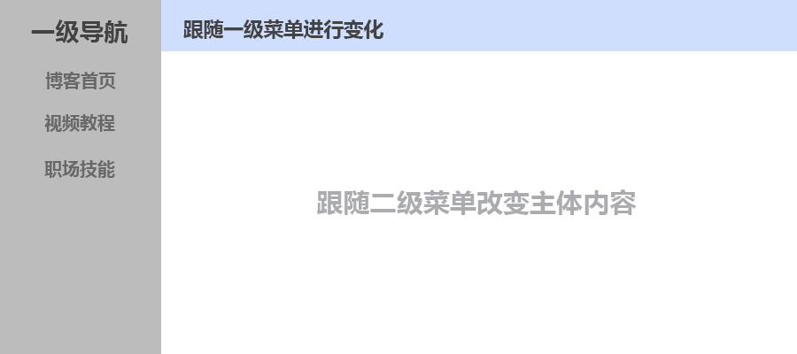

# React Router
> React Router 是一个基于React之上的强大路由库，它可以让你向应用中快速地添加视图和数据流，同时保持页面与URL间的同步。

## React Router 安装和基础环境搭建
**用creact-react-app脚手架初始化项目**

1. 如果你没有安装脚手架工具，你需要安装一下:
``` js
npm install -g create-react-app
```

2. 直接使用脚手架工具创建项目
``` js
D:  //进入D盘
mkdir ReactRouterDemo   //创建ReactRouterDemo文件夹
cd ReactRouterDemo      //进入文件夹
create-react-app demo01  //用脚手架创建React项目
cd demo01   //等项目创建完成后，进入项目目录
npm  start  //预览项目
```
这样项目就制作好了，我们删除一下没用的文件，让代码结构保持最小化。删除SRC里边的所有文件，只留一个index.js,并且index.js文件里也都清空。

**使用npm安装React Router**
``` js
npm install --save react-router-dom
```
安装完成后可以到package.json里看一下安装的版本。

**编写一个最简单的路由程序**

首先我们改写src文件目录下的index.js代码。改为下面的代码,具体的意思在视频中讲解:
``` js
import React from 'react';
import ReactDOM from 'react-dom'
import AppRouter from './AppRouter'

ReactDOM.render(<AppRouter/>,document.getElementById('root'))
```
现在的AppRouter组件是没有的，我们可以在src目录下建立一个AppRouter.js文件，然后写入下面的代码。
``` js
import React from "react";
import { BrowserRouter as Router, Route, Link } from "react-router-dom";

function Index() {
  return <h2>Home.com</h2>;
}

function List() {
  return <h2>List-Page</h2>;
}

function AppRouter() {
  return (
    <Router>
        <ul>
            <li> <Link to="/">首页</Link> </li>
            <li><Link to="/list/">列表</Link> </li>
        </ul>
        <Route path="/" exact component={Index} />
        <Route path="/list/" component={List} />
    </Router>
  );
}
export default AppRouter;
```
这时候就可以到浏览器中看一下效果了，如果一切正常，就可以实现页面跳转。但这只是最简单的页面跳转。

## 像制作普通网页一样使用ReactRouter
通过上节的学习，有小伙伴反应这和他们平时工作中见到的不太一样，现实中是每个页面都是一个完整的有状态组件，然后我们再进行跳转，而不是写在一个页面里的多个无状态组件。所以觉的不太适用，这节课就把上节课的案例，做成我们工作中的样子，或者说更贴合实际开发.还会讲解一下精确匹配的知识。

**编写Index组件**
先在/src目录下建立一个文件夹，我这里起名叫做Pages（你可以起任何名字），然后建立一个组件文件Index.js。这里边我们就完全安装工作中的模式来写，只是没有什么业务逻辑，UI也制作的相当加简单。代码如下：
``` js
import React, { Component } from 'react';

class Index extends Component {
    constructor(props) {
        super(props);
        this.state = {  }
    }
    render() { 
        return (  <h2>Index.com</h2> );
    }
}
 
export default Index;
```
**编写List组件**

编写完Index组件以后，继续编写List组件。其实这个组件和Index基本一样。代码如下:
``` js
import React, { Component } from 'react';

class List extends Component {
    constructor(props) {
        super(props);
        this.state = {  }
    }
    render() { 
        return (  <h2>List Page</h2> );
    }
}
 
export default List;
```
**修改AppRouter.js文件**
两个组件制作完成后，我们把它引入路由配置文件，然后进行路由的配置就可以了，代码如下：
``` jsx
import React from "react";
import { BrowserRouter as Router, Route, Link } from "react-router-dom";
import Index from './Pages/Index'
import List from './Pages/List'

function AppRouter() {
  return (
    <Router>
        <ul>
            <li> <Link to="/">首页</Link> </li>
            <li><Link to="/list/">列表</Link> </li>
        </ul>
        <Route path="/" exact component={Index} />
        <Route path="/list/" component={List} />
    </Router>
  );
}

export default AppRouter;
```
现在看起来就和我们实际工作中差不多了，也和我们平时写的普通html页面很类似了。

**exact精准匹配的意思**
这个也是一个小伙伴问我的问题，精准匹配到底是什么？其实这个很好理解，从字面上就可以猜出结果，就是你的路径信息要完全匹配成功，才可以实现跳转，匹配一部分是不行的。

比如我们把Index的精准匹配去掉，你会发现，无论你的地址栏输入什么都可以匹配到Index组件，这并不是我们想要的结果。
``` js
<Route path="/" component={Index} />
```
所以我们加上了精准匹配exact。你可以再试着访问一下List组件，来更深入的了解一下精准匹配。

## ReactRouter动态传值-1
**在Route上设置允许动态传值**

这个设置是以 : 开始的，然后紧跟着你传递的key（键名称）名称。我们来看一个简单的例子。

<Route path="/list/:id" component={List} />
看过代码后，你会觉的很简单，就是在path上加:id。这样就设置了允许传值的规则。

**Link上传递值**
设置好规则后，就可以在Link上设置值了，现在设置传递的ID值了，这时候不用再添加id了，直接写值就可以了。
``` js
<li><Link to="/list/123">列表</Link> </li>
```
现在就可以进行传值了。为了方便你的学习，这里给出全部AppRouter.js代码。
``` js
import React from "react";
import { BrowserRouter as Router, Route, Link } from "react-router-dom";
import Index from './Pages/Index'
import List from './Pages/List'

function AppRouter() {
  return (
    <Router>
        <ul>
            <li> <Link to="/">首页</Link> </li>
            <li><Link to="/list/123">列表</Link> </li>
        </ul>
        <Route path="/" exact component={Index} />
        <Route path="/list/:id" component={List} />
    </Router>
  );
}

export default AppRouter;
```
**在List组件上接收并显示传递值**
组件接收传递过来的值的时候，可以在声明周期componentDidMount中进行，传递的值在this.props.match中。我们可以先打印出来,代码如下。
``` js
import React, { Component } from 'react';

class List extends Component {
    constructor(props) {
        super(props);
        this.state = {  }
    }
    render() { 
        return (  <h2>List Page</h2> );
    }
    //-关键代码---------start
    componentDidMount(){
        console.log(this.props.match)
    }
    //-关键艾玛---------end
}
 
export default List;
```
然后在浏览器的控制台中可以看到打印出的对象，对象包括三个部分:
``` sh
● patch:自己定义的路由规则，可以清楚的看到是可以产地id参数的。
● url: 真实的访问路径，这上面可以清楚的看到传递过来的参数是什么。
● params：传递过来的参数，key和value值。
```
明白了match中的对象属性，就可以轻松取得传递过来的ID值了。代码如下:
``` js
import React, { Component } from 'react';

class List extends Component {
    constructor(props) {
        super(props);
        this.state = {  }
    }
    render() { 
        return (  <h2>List Page->{this.state.id}</h2> );
    }
    componentDidMount(){
       // console.log(this.props.match.params.id)
       let tempId=this.props.match.params.id
        this.setState({id:tempId })
    }
}
 
export default List;
```
这样就实现了动态传值，需要注意的是如果你不传任何东西，是没办法匹配路由成功的。下一节我们更加形象的作一个动态列表，然后进行动态传值。这节课算是一个理论基础吧。

## ReactRouter动态传值-2
**模拟一个列表数组**

现在可以在Index组件里模拟一个列表数组，就相当于我们从后台动态获取到的内容，然后数组中包括文章的cid和title。直接在state初始化时进行设置，代码如下：
``` js
 constructor(props) {
    super(props);
    this.state = { 
        list:[
            {cid:123,title:'个人网址-1'},
            {cid:456,title:'个人网址-2'},
            {cid:789,title:'个人网址-3'},
        ]
    }
}
```
有了list数组后，再修改一下UI，进行有效的遍历，Render代码如下。
``` js
 render() { 
    return ( 
        <ul>
            {
                this.state.list.map((item,index)=>{
                    return (
                        <li key={index}> {item.title} </li>
                    )
                })
            }
        </ul>
    )
}
```
列表已经可以在Index组件里显示出来了，接下来可以配置Link了,在配置之前，你需要先引入Link组件。
``` js
import { Link } from "react-router-dom";
```
引入后直接使用进行跳转就可以，但是需要注意一点，要用{}的形式，也就是把to里边的内容解析成JS的形式，这样才能顺利的传值过去。
``` js
render() { 
    return ( 
        <ul>
            {
                this.state.list.map((item,index)=>{
                    return (
                        <li key={index}>
                            <Link to={'/list/'+item.uid}> {item.title}</Link> 
                        </li>
                    )
                })
            }
        </ul>
    )
}
```
到目前为止，已经很类似我们项目中的列表向详细页进行传值了。为了方便你学习，给出Index.js的所有代码.
``` js
import React, { Component } from 'react';
import { Link } from "react-router-dom";

class Index extends Component {
    constructor(props) {
        super(props);
        this.state = { 
            list:[
                {uid:123,title:'个人网址-1'},
                {uid:456,title:'个人网址-2'},
                {uid:789,title:'个人网址-3'},
            ]
         }
    }
    render() { 
        return ( 
            <ul>
                {
                    this.state.list.map((item,index)=>{
                        return (
                            <li key={index}>
                               <Link to={'/list/'+item.uid}> {item.title}</Link> 
                            </li>
                        )
                    })
                }
            </ul>
        )
    }
}

export default Index;
```
## ReactRouter重定向-Redirect使用
``` sh
● 标签式重定向:就是利用Redirect标签来进行重定向，业务逻辑不复杂时建议使用这种。
● 编程式重定向:这种是利用编程的方式，一般用于业务逻辑当中，比如登录成功挑战到会员中心页面。
```
::: warning 注意
重定向和跳转有一个重要的区别，就是跳转式可以用浏览器的回退按钮返回上一级的，而重定向是不可以的（其中，标签式重定向是可以用浏览器的回退按钮返回上一级，而编程式重定向是不能通过浏览器返回上一级的）。
:::
**标签式重定向**

这个一般用在不是很复杂的业务逻辑中，比如我们进入Index组件，然后Index组件,直接重定向到Home组件。我们也结合这个场景，看一下如何实现。

首先建立一个Home.js的页面，这个页面我还是用快速生成的方式来进行编写，代码如下。
``` js
import React, { Component } from 'react';

class Home extends Component {
    constructor(props) {
        super(props);
        this.state = {  }
    }
    render() { 
        return (  <h2>我是 Home 页面</h2> );
    }
}
 
export default Home;
```
这个页面非常简单，就是一个普通的有状态组件。

有了组件后可以配置一下路由规则，也就是在AppRouter.js里加一个Route配置，配置时记得引入Home组件。
``` js
import Home from './Pages/Home'
<Route path="/home/" component={Home} />
```
之后打开Index.js文件，从Index组件重新定向到Home组件，需要先引入Redirect。
``` js
import { Link , Redirect } from "react-router-dom";
```
引入Redirect后，直接在render函数里使用就可以了。
```
<Redirect to="/home/" />
```
现在就可以实现页面的重定向。

**编程式重定向**

编程式重定向就是不再利用<Redirect/>标签，而是直接使用JS的语法实现重定向。他一般用在业务逻辑比较发杂的场合或者需要多次判断的场合。我们这里就不模拟复杂场景了，还是利用上边的例子实现一下，让大家看到结果就好。

比如直接在构造函数constructor中加入下面的重定向代码。
``` js
this.props.history.push("/home/");  
```
就可以顺利实现跳转，这样看起来和上面的过程是一样的。这两种方式的重定向你可以根据真实需求使用，这样能让你的程序更加的灵活。

## ReactRouter嵌套路由-1
这也算是一个小实例，在这个过程中我们会复习以前的路由知识，并利用以前的知识构建有些复杂的路由关系。



**用脚手架创建项目**

重新创建一个项目Demo02,直接在VSCode里输入，下面的命令初始化项目代码。
``` js
create-react-app demo02
```
这样项目就创建好了，但是里边有很多暂时不需要的文件，删除这些，让代码结构保持最小化。只留/src目录里的index.js文件，然后再删除一些index.js文件里无用的代码。

项目初始化好以后，再在安装React Router,使用npm来进行安装(安装时记得要进入到Demo02文件夹中)。
``` js
npm install --save react-router-dom
```
**初始化基本目录**
根据草图分析，可以指导有两层关系，第一层是大类，第二层是子类别。先再/src目录下建立一个Pages的文件夹。然后在/Pages目录下再建立两个目录/video和/workPlace,然后在/src目录下建立一个AppRouter.js文件作为首页和路由的配置文件。目录结构如下所示:
``` js
- src
|--Pages
   |--video
   |--workPlace
|--index.js
|--AppRouter.js
```
建立完成后，我们先编写AppRouter.js,为的是让程序拥有首页，并让程序可以跑起来。文件新建以后可以用快速生成代码的方式，把基本代码做完。
``` js
import React from "react";
import { BrowserRouter as Router, Route, Link  } from "react-router-dom";
import Index from './Pages/Index'
import './index.css'

function AppRouter() {
    return (
      <Router>
          <div className="mainDiv">
            <div className="leftNav">
                <h3>一级导航</h3>
                <ul>
                    <li> <Link to="/">博客首页</Link> </li>
                    <li><Link to="">视频教程</Link> </li>
                    <li><Link to="">职场技能</Link> </li>
                </ul>
            </div>
            
            <div className="rightMain">
                <Route path="/"  exact component={Index} />
            </div>
          </div>
      </Router>
    );
}
  
export default AppRouter;
```
写完这个文件，然后修改一下/src/index.js文件，需要引入AppRouter，并进行Render渲染。
``` js
import React from 'react'
import ReactDOM from 'react-dom'
import AppRouter from './AppRouter'
ReactDOM.render(<AppRouter />, document.getElementById('root'));
```
这时候就可以在终端里输入npm start让程序跑起来，然后去浏览器中进行查看了。

**添加基本样式**

在/src目录下，新建一个index.css文件，然后编写下面的样式。
``` css
body{
    padding: 0px;
    margin: 0px;
}

.mainDiv{
    display: flex;
    width: 100%;
}
.leftNav{
    width: 16%;
    background-color: #c0c0c0;
    color:#333;
    font-size:24px;
    height: 1000px;
    padding: 20px;
}
.rightMain{
    width: 84%;
    height:1000px;
    background-color: #fff;
    font-size:20px;
    
}
```
写完之后把这个CSS文件引入到AppRouter.js文件中，就可以有一定的样式了。然后再到浏览器中查看一下效果，如果能正常显示，说明到目前为止，我们制作的是正确的。

## 实例-ReactRouter嵌套路由-2
**编写Video中的子页面**

在编写Video.js页面之前，我们需要在/src/Pages/video下面建立三个子文件，分别是ReactPage.js,Flutter.js和Vue.js，也代表着不同的视频页面。

ReactPage.js组件
``` js
import React from "react";
function Reactpage(){
    return (<h2>我是React页面</h2>)
}
export default Reactpage;
```
Flutter.js组件
``` js
import React from "react";
function Flutter(){
    return (<h2>我是Flutter页面</h2>)
}
export default Flutter;
```
Vue.js组件
``` js
import React from "react";
function Vue(){
    return (<h2>我是Vue页面</h2>)
}
export default Vue;
```
这样就相当于三个页面做好了，当然咱们作的是非常简单的。

**编写Video.js页面**
这个页面就是二级导航的编写，这个的编写也是课程的重点。
``` js
import React from "react";
import {  Route, Link  } from "react-router-dom";
import Reactpage from './video/ReactPage'
import Vue from './video/Vue'
import Flutter from './video/Flutter'
function Video(){
    return (
        <div>
            <div className="topNav">
                <ul>
                    <li><Link to="/video/reactpage">React教程</Link></li>
                    <li><Link to="/video/vue">Vue教程</Link></li>
                    <li><Link to="/video/flutter">Flutter教程</Link></li>
                </ul>
            </div>
            <div className="videoContent">
                <div><h3>视频教程</h3></div>
                <Route path="/video/reactpage/"   component={Reactpage} />
                <Route path="/video/vue/"   component={Vue} />
                <Route path="/video/flutter/"   component={Flutter} />
            </div>
        </div>
    )
}
export default Video;
```
**修改AppRouter.js文件**
当我们的Video组件制作完成后，可以把它引入到AppRouter.js文件中，然后配置对应的路由。为了方便你的学习，这里给出了全部代码，并在重用修改的地方给予标注。
``` js
import React from "react";
import { BrowserRouter as Router, Route, Link  } from "react-router-dom";
import Index from './Pages/Index'
//--关键代码------------start
import Video from './Pages/Video'
//--关键代码------------end
import './index.css'

function AppRouter() {
    return (
      <Router>
          <div className="mainDiv">
            <div className="leftNav">
                <h3>一级导航</h3>
                <ul>
                    <li> <Link to="/">博客首页</Link> </li>
                    {/*--关键代码------------start*/}
                    <li><Link to="/video/">视频教程</Link> </li>
                    {/*--关键代码------------end*/}
                    <li><Link to="">职场技能</Link> </li>
                </ul>
            </div>
            
            <div className="rightMain">
                <Route path="/"  exact component={Index} />
                 {/*--关键代码------------start*/}
                <Route path="/video/"   component={Video} />
                 {/*--关键代码------------end*/}
            </div>
          </div>
      </Router>
    );
}
  
export default AppRouter;
```
这时候就可以到浏览器中看看效果了，当然目前还没有CSS样式，所以不是很好看。
``` css
.topNav{
    height:50px ;
    background-color: #cfdefd;
}
.topNav ul{
   display: flex; 
   margin: 0px;
   padding: 0px;
}
.topNav li{
   padding: 10px;
   text-align: center;
   list-style: none;
 }
 .videoContent{
     padding:20px;
 }
```
这样我们就实现了React Router的路由嵌套功能，看起来还是非常简单的。

## 实例-ReactRouter嵌套路由-3
**编写第三级子页面**
在"职场技能"里只作两个子页面，"程序员加薪秘籍"和"程序员早起攻略"。在/src/Pages/workPlace目录下，新建两个文件Money.js和Getup.js，然后编写代码。

Money.js
``` js
import React from "react";
function Money(){
    return (<h2>程序员加薪秘籍详情</h2>)
}
export default Money;
```
Getup.js
``` js
import React from "react";
function Getup(){
    return (<h2>程序员早起攻略详情</h2>)
}
export default Getup;
```
#编写二级子页面Workplace
在/src/Pages文件夹下建立一个Workplace.js页面，作为二级子页面。
``` js
import React from "react";
import {  Route, Link  } from "react-router-dom";
import Money from './workPlace/Money'
import Getup from './workPlace/Getup'
function WorkPlace(){
    return (
        <div>
            <div className="topNav">
                <ul>
                    <li><Link to="/workplace/Moeny">程序员加薪秘籍</Link></li>
                    <li><Link to="/workplace/Getup">程序员早起攻略</Link></li>
                   
                </ul>
            </div>
            <div className="videoContent">
                <div><h3>职场软技能</h3></div>
                <Route path="/workplace/Moeny/"   component={Money} />
                <Route path="/workplace/Getup/"   component={Getup} />
               
            </div>
        </div>
    )
}
export default WorkPlace;
```
这个组件完成后，可以进入主路由里把二级页面配置一下。

**配置主路由AppRouter.js**
这个我就直接给出文件代码了，思路是先引入要配置的路由Workplace,然后配置路由Route,最后编写链接Link。
``` js
import React from "react";
import { BrowserRouter as Router, Route, Link  } from "react-router-dom";
import Index from './Pages/Index'
import Video from './Pages/Video'
import Workplace from './Pages/Workplace'
import './index.css'

function AppRouter() {
    return (
      <Router>
          <div className="mainDiv">
            <div className="leftNav">
                <h3>一级导航</h3>
                <ul>
                    <li> <Link to="/">博客首页</Link> </li>
                    <li><Link to="/video/">视频教程</Link> </li>
                    <li><Link to="/workplace">职场技能</Link> </li>
                </ul>
            </div>
            
            <div className="rightMain">
                <Route path="/"  exact component={Index} />
                <Route path="/video/"   component={Video} />
                <Route path="/workplace/"   component={Workplace} />
            </div>
          </div>
      </Router>
    );
}
  
  
export default AppRouter;
```  
完成后，就可以再浏览器长查看一下效果，可以正常显示就说明一切正常，我们这个小案例也就算完成了。

## 后台动态获取路由进行配置
**模拟后台得到的JSON数据**

我们现在AppRouter.js文件里，模拟从后台得到了JSON字符串，并转换为了对象（我们只是模拟，就不真的去远端请求数据了）。模拟的代码如下:
``` js
let routeConfig =[
    {path:'/',title:'博客首页',exact:true,component:Index},
    {path:'/video/',title:'视频教程',exact:false,component:Video},
    {path:'/workplace/',title:'职场技能',exact:false,component:Workplace}
]
```
**循环出Link区域**
这时候一级导航就不能是写死了，需要根据得到的数据进行循环出来。直接使用map循环就可以。代码如下：
``` js
<ul>
    {
        routeConfig.map((item,index)=>{
            return (<li key={index}> <Link to={item.path}>{item.title}</Link> </li>)
        })
    }
</ul>
``` 
这时候就可以把所有的Link标签都循环出来了。

**循环出路由配置**

按照上面的逻辑把Route的配置循环出来。代码如下:
``` js
{
    routeConfig.map((item,index)=>{
        return (<Route key={index} exact={item.exact} path={item.path}  component={item.component} />)
    })
}
```
为了方便你学习，这里给出AppRouter.js的全部代码。
``` js
import React from "react";
import { BrowserRouter as Router, Route, Link  } from "react-router-dom";
import Index from './Pages/Index'
import Video from './Pages/Video'
import Workplace from './Pages/Workplace'
import './index.css'

function AppRouter() {
    let routeConfig =[
      {path:'/',title:'博客首页',exact:true,component:Index},
      {path:'/video/',title:'视频教程',exact:false,component:Video},
      {path:'/workplace/',title:'职场技能',exact:false,component:Workplace}
    ]
    return (
      <Router>
          <div className="mainDiv">
            <div className="leftNav">
                <h3>一级导航</h3>
                <ul>
                    {
                      routeConfig.map((item,index)=>{
                          return (<li key={index}> <Link to={item.path}>{item.title}</Link> </li>)
                      })
                    }
                </ul>
            </div>
            
            <div className="rightMain">
                    {
                      routeConfig.map((item,index)=>{
                          return (<Route key={index} exact={item.exact} path={item.path}  component={item.component} />)
                      })
                    }
                
            </div>
          </div>
      </Router>
    );
}
  
  
export default AppRouter;
```
  到这里就可以实现动态显示路由了，并且可以后台进行配置了，但是这应该都是架构层考虑的东西了。如果你刚接触React，可能这种用法的不多。但是你可以利用这模式来设计你静态的路由，增加你程序的扩展性。