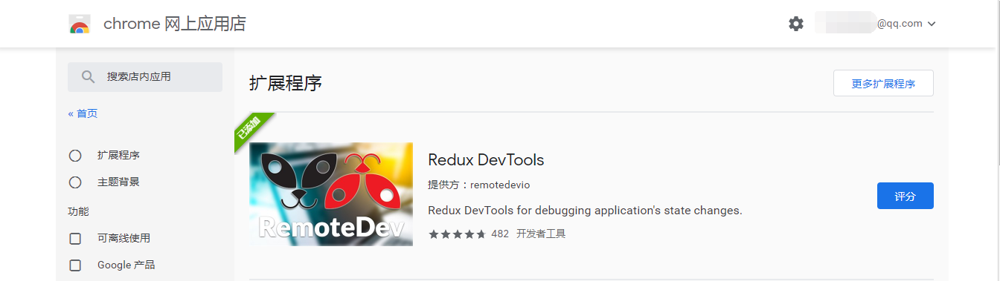

# Redux 基础

## Redux介绍
Redux是一个用来管理管理数据状态和UI状态的JavaScript应用工具。随着JavaScript单页应用（SPA）开发日趋复杂，JavaScript需要管理比任何时候都要多的state（状态），Redux就是降低管理难度的。（Redux支持React，Angular、jQuery甚至纯JavaScript）

## Ant Design介绍和环境初始化
1. 如果你没有安装脚手架工具，你需要安装一下：
``` js
npm install -g create-react-app
```
2. 直接用脚手架工具创建项目
``` js
D:  //进入D盘
mkdir ReduxDemo   //创建ReduxDemo文件夹
cd ReduxDemo      //进入文件夹
create-react-app demo01  //用脚手架创建React项目
cd demo01   //等项目创建完成后，进入项目目录
npm  start  //预览项目
```
这样项目就制作好了，我们删除一下没用的文件，让代码结构保持最小化。删除SRC里边的所有文件，只留一个index.js,并且index.js文件里也都清空。

**快速生成基本代码结构**

编写index.js文件,这个文件就是一个基础文件，基本代码也都是一样的。
``` js
import React from 'react';
import ReactDOM from 'react-dom'
import TodoList from './TodoList'

ReactDOM.render(<TodoList/>,document.getElementById('root'))
```
编写TodoList.js文件,这个文件可以用Simple React Snippets快速生成。 先输入imrc,再输入ccc，
代码如下：
``` js
import React, { Component } from 'react';
class TodoList extends Component {
    render() { 
        return ( 
            <div>Hello World</div>
         );
    }
}
export default TodoList;
```
做完这个，算是项目基本构建完成，可以打开浏览器看一下效果。接下来就可以安装Ant DesignUI框架了。

**安装AntDesign**

这里使用npm来进行安装，当然你有可以用yarn的方式进行安装.
``` js
npm install antd --save
```
yarn的安装方式是:
``` js
yarn add antd
```
如果你的网络情况不好，最好使用cnpm来进行安装。

## 用Ant Design制作UI界面
**引入CSS样式**

在使用Ant Design时，第一件事就是先引入CSS样式，有了样式才可以让UI组件显示正常。可以直接在/src/TodoList.js文件中直接用import引入。
``` js
import 'antd/dist/antd.css';
```
**编写Input框**

引入CSS样式之后，可以快乐的使用antd里的input框了，在使用的时候，你需要先引入Input组件。全部代码如下:
``` js
import React, { Component } from 'react';
import 'antd/dist/antd.css'
import { Input } from 'antd'

class TodoList extends Component {
    render() { 
        return ( 
            <div>
                <div>
                    <Input placeholder='Write something' style={{ width:'250px'}}/>
                </div>
            </div>
         );
    }
}
export default TodoList;
```
在Input组件里，我们设置了style，注意设置这个时不带单引号或者双引号的。

写完后就可以简单的看一下效果了。

**编写Button按钮**

Ant Design也提供了丰富好看的按钮组件，直接使用最简单的Primary按钮。使用按钮组件前也需要先引入,为了让组件更好看，还加入了一些Margin样式，代码如下:
``` js
import React, { Component } from 'react';
import 'antd/dist/antd.css'
import { Input , Button } from 'antd'

class TodoList extends Component {
    render() { 
        return ( 
            <div style={{margin:'10px'}}>
                <div>
                    <Input placeholder='Write something' style={{ width:'250px', marginRight:'10px'}}/>
                    <Button type="primary">增加</Button>
                </div>
            </div>
         );
    }
}
export default TodoList;
```
**List组件制作列表**

同样用Ant Desgin制作todoList的列表，在制作前，我们先在class外部声明一个data数组，数组内容可以随便写。
``` js
const data=[
    '早8点开晨会，分配今天的开发工作',
    '早9点和项目经理作开发需求讨论会',
    '晚5:30对今日代码进行review'
]
```
然后引入List组件，代码如下:
``` js
import { Input , Button , List } from 'antd'
```
最后就是使用这个List组件了。
``` js
<div style={{margin:'10px',width:'300px'}}>
    <List
        bordered
        dataSource={data}
        renderItem={item=>(<List.Item>{item}</List.Item>)}
    />    
</div>
```
为了方便学习，我给出了全部代码，如果你作起来有难度，可以直接复制下面的代码。
``` js
import React, { Component } from 'react';
import 'antd/dist/antd.css'
import { Input , Button , List } from 'antd'

const data=[
    '早8点开晨会，分配今天的开发工作',
    '早9点和项目经理作开发需求讨论会',
    '晚5:30对今日代码进行review'
]

class TodoList extends Component {
    render() { 
        return ( 
            <div style={{margin:'10px'}}>
                <div>
                    <Input placeholder='write someting' style={{ width:'250px', marginRight:'10px'}}/>
                    <Button type="primary">增加</Button>
                </div>
                <div style={{margin:'10px',width:'300px'}}>
                    <List
                        bordered
                        dataSource={data}
                        renderItem={item=>(<List.Item>{item}</List.Item>)}
                    />    
                </div>
            </div>
         );
    }
}
export default TodoList;
```

## 创建Redux中的仓库-store和reducer
**编写创建store仓库**

在使用Redux之前，需要先用npm install来进行安装,打开终端，并进入到项目目录，然后输入。（如果你之前安装过了，就不用再次安装了）
``` js
npm install --save redux // 生产环境安装redux
```
安装好redux之后，在src目录下创建一个store文件夹,然后在文件夹下创建一个index.js文件。

index.js就是整个项目的store文件，打开文件，编写下面的代码。
``` js
import { createStore } from 'redux';   // 引入createStore方法
const store = createStore();          // 创建数据存储仓库
export default store;                 //暴露出去
```
这样虽然已经建立好了仓库，但是这个仓库很混乱，这时候就需要一个有管理能力的模块出现，这就是Reducers。这两个一定要一起创建出来，这样仓库才不会出现互怼现象。在store文件夹下，新建一个文件reducer.js,然后写入下面的代码。
``` js
const defaultState = {};  //默认数据
export default (state = defaultState, action)=>{  //就是一个方法函数
    return state;
}
```
**state:**是整个项目中需要管理的数据信息,这里我们没有什么数据，所以用空对象来表示。
这样reducer就建立好了，把reducer引入到store中,再创建store时，以参数的形式传递给store。
``` js
import { createStore } from 'redux'  //  引入createStore方法
import reducer from './reducer'    
const store = createStore(reducer) // 创建数据存储仓库
export default store   //暴露出去
```
**在store中为todoList初始化数据**

仓库store和reducer都创建好了，可以初始化一下todoList中的数据了，在reducer.js文件的defaultState对象中，加入两个属性:inputValue和list。代码如下
``` js
const defaultState = {
    inputValue : 'Write Something',
    list:[
        '早8点开晨会，分配今天的开发工作',
        '早9点和项目经理作开发需求',
        '晚5.30对今日代码进行review'
    ]
}
export default (state = defaultState,action)=>{
    return state;
}
```
这就相当于你给Store里增加了两个新的数据。

**组件获得store中的数据**

有了store仓库，也有了数据，那如何获得stroe中的数据那？你可以在要使用的组件中，先引入store。 我们todoList组件要使用store，就在src/TodoList.js文件夹中，进行引入。这时候可以删除以前写的data数据了。
``` js
import store from './store/index'
```
当然你也可以简写成这样:
``` js
import store from './store'
```
引入store后可以试着在构造方法里打印到控制台一下，看看是否真正获得了数据，如果一切正常，是完全可以获取数据的。
``` js
constructor(props){
    super(props)
    console.log(store.getState()) // store.getState()为获取store中defaultState的值
}
```
这时候数据还不能在UI层让组件直接使用，我们可以直接复制给组件的state，代码如下(我这里为了方便学习，给出全部代码了).
``` js
import React, { Component } from 'react';
import 'antd/dist/antd.css'
import { Input , Button , List } from 'antd'
import store from './store'

class TodoList extends Component {
constructor(props){
    super(props)
    //关键代码-----------start
    this.state=store.getState();
    //关键代码-----------end
    console.log(this.state)
}
    render() { 
        return ( 
            <div style={{margin:'10px'}}>
                <div>
                    
                    <Input placeholder={this.state.inputValue} style={{ width:'250px', marginRight:'10px'}}/>
                    <Button type="primary">增加</Button>
                </div>
                <div style={{margin:'10px',width:'300px'}}>
                    <List
                        bordered
                        //关键代码-----------start
                        dataSource={this.state.list}
                        //关键代码-----------end
                        renderItem={item=>(<List.Item>{item}</List.Item>)}
                    />    
                </div>
            </div>
         );
    }
}
export default TodoList;
```
通过上面的步骤，我们从仓库里取出了数据，并用在组件的UI界面上，也算是一个小小的进步了。

## Redux Dev Tools的安装
> 安装此工具需要科学上网。

**安装Redux DevTools**

我使用Chrome浏览器安装插件，在浏览器右上角有三个点，然后点击"更多工具",再点击"扩展程序"，再点击右侧的"打开Chrome网上商店",然后搜索Redux DevTools，可以看到下面这个插件，直接安装就可以了。



安装完成后，你在控制台中就可以看到Redux标签了，有了这个标签也说明安装成功了。

**配置Redux Dev Tools**

如何配置这个Redux Dev Tools插件? 其实在(Redux Dev Tools网站)[https://github.com/zalmoxisus/redux-devtools-extension]上已经说的非常清楚了，现在通过插件，打开这个网站。根据网站提示，可以将index.js代码改为下面的样子。
``` js
import { createStore } from 'redux';  //  引入createStore方法
import reducer from './reducer';
const store = createStore(
  reducer,
  window.__REDUX_DEVTOOLS_EXTENSION__ && window.__REDUX_DEVTOOLS_EXTENSION__()
  ); // 创建数据存储仓库
export default store;  //暴露出去
```
其实就是加了这样一句话.
``` js
window.__REDUX_DEVTOOLS_EXTENSION__ && window.__REDUX_DEVTOOLS_EXTENSION__()
```
这句话的意思就是看window里有没有这个方法，有则执行这个方法（不要被大写的方法名吓到）。

这步完成后，就可以启动项目测试一下了，你会发现State数据变的一目了然，以后再进行Redux调试，就会变的非常简单了。

## 通过Input体验Redux的流程
通过Input的改变，体验一下Redux的整体流程，是如何编写代码的。我们要实现的是在TodoList的Demo中,只要文本框中的值改变就redux中store的值就跟着改变，并且随着Redux中的state值改变，组件也跟着改变。

**增加Input响应事件**

如果想Input改变，redux也跟着改变，需要在Input组件上增加onChange响应事件， 打开src目录下的ToDolist.js文件，修改具体代码如下：
``` js
<Input 
    placeholder={this.state.inputValue} 
    style={{ width:'250px', marginRight:'10px'}}
    //---------关键代码----start
    onChange={this.changeInputValue}
    //---------关键代码----end
/>
```
写完这一步，还要记得在constructor进行this的绑定，修改this的指向。
``` js
constructor(props){
    super(props)
    this.state=store.getState();
    this.changeInputValue= this.changeInputValue.bind(this)
}
```
这步完成后，就可以编写changeInputValue方法的代码了。我们先在控制台打印出文本框的变化，代码如下：
``` js
changeInputValue(e){
    console.log(e.target.value)
}
```
然后打开浏览器，按F12看一下控制台的结果。这里给出目前的全部代码:
``` js
import React, { Component } from 'react';
import 'antd/dist/antd.css'
import { Input , Button , List } from 'antd'
import store from './store'

class TodoList extends Component {
    constructor(props){
        super(props)
        this.state=store.getState();
        this.changeInputValue= this.changeInputValue.bind(this)
    }
    render() { 
        return ( 
            <div style={{margin:'10px'}}>
                <div>
                    <Input 
                        placeholder={this.state.inputValue} 
                        style={{ width:'250px', marginRight:'10px'}}
                        onChange={this.changeInputValue}
                    />
                    <Button type="primary">增加</Button>
                </div>
                <div style={{margin:'10px',width:'300px'}}>
                    <List
                        bordered
                        dataSource={this.state.list}
                        renderItem={item=>(<List.Item>{item}</List.Item>)}
                    />    
                </div>
            </div>
         );
    }

    changeInputValue(e){
        console.log(e.target.value)
    }
}
export default TodoList;
```
下面需要作的事就是改变Redux里的值了，我们继续向下学习。

**创建Action**

想改变Redux里边State的值就要创建Action了。**Action就是一个对象，这个对象一般有两个属性，第一个是对Action的描述，第二个是要改变的值。**
``` js
changeInputValue(e){
    const action ={
        type:'change_input_value',
        value:e.target.value
    }
}
```
action就创建好了，但是要通过dispatch()方法传递给store。我们在action下面再加入一句代码。
``` js
changeInputValue(e){
    const action ={
        type:'changeInput',
        value:e.target.value
    }
    store.dispatch(action)
}
```
这是Action就已经完全创建完成了，也和store有了联系。

**store的自动推送策略**
已经知道store只是一个仓库，它并没有管理能力，它会把接收到的action自动转发给Reducer。我们现在先直接在Reducer中打印出结果看一下。打开store文件夹下面的reducer.js文件，修改代码。
``` js
export default (state = defaultState,action)=>{
    console.log(state,action)
    return state
}
```
讲到这里，就可以解释一下两个参数了：
``` sh
● state: 指的是原始仓库里的状态。
● action: 指的是action新传递的状态。
```
通过打印你可以知道，Reducer已经拿到了原来的数据和新传递过来的数据，现在要作的就是改变store里的值。我们先判断type是不是正确的，如果正确，我们需要从新声明一个变量newState。**（记住：Reducer里只能接收state，不能改变state。）**,所以我们声明了一个新变量，然后再次用return返回回去。
``` js
export default (state = defaultState,action)=>{
    if(action.type === 'changeInput'){
        let newState = JSON.parse(JSON.stringify(state)) //深度拷贝state
        newState.inputValue = action.value
        return newState
    }
    return state
}
```
**让组件发生更新**

现在store里的数据已经更新了，但是组件还没有进行更新，我们需要打开组件文件TodoList.js，在constructor，写入下面的代码。
``` js
constructor(props){
    super(props)
    this.state=store.getState();
    this.changeInputValue= this.changeInputValue.bind(this)
    //----------关键代码-----------start
    this.storeChange = this.storeChange.bind(this)  //转变this指向
    store.subscribe(this.storeChange) //订阅Redux的状态
    //----------关键代码-----------end
}
```
当然我们现在还没有这个storeChange方法，只要写一下这个方法，并且重新setState一次就可以实现组件也是变化的。在代码的最下方，编写storeChange方法。
``` js
storeChange(){
     this.setState(store.getState())
}
```
现在浏览器中预览，可以看到组件和Redux中都同步进行了改变。

## Redux制作ToDoList列表
我们用同样的方法和流程，再开发一遍toDoList里边的列表功能，具体来说就是当点击添加按钮时，ToDoList组件的列表会增加。

**编写按钮添加响应事件和Action**

先来编写按钮点击后的响应事件，打开TodoList.js文件，然后在按钮的地方加入onClick事件，记得要进行绑定哦。
``` js
<Button 
    type="primary"
    onClick={this.clickBtn}
>增加</Button>
```
然后在constructor里进行绑定，代码如下:
``` js
constructor(props){
    super(props)
    this.state=store.getState();
    this.changeInputValue= this.changeInputValue.bind(this)
    this.storeChange = this.storeChange.bind(this)
    //关键代码------------start----------
    this.clickBtn = this.clickBtn.bind(this)
    //关键代码------------end----------
    store.subscribe(this.storeChange) //订阅Redux的状态
}
```
绑定之后就可以编写clickBtn()方法了，这里先用一个打印语句代替业务内容。
``` js
clickBtn(){
    console.log('点击成功')
}
```
这时候预览一下，点击"增加按钮"，在控制台就可以输出“点击成功”了。说明我们的事件添加成功了。

**创建Action并用dispatch()传递给store**

在clickBtn方法里增加Action，然后用dispatch()方法传递给store，代码如下:
``` js
clickBtn(){
   const action = { type:'addItem'}
   store.dispatch(action)
}
```
这时候已经把action传递给了store，然后去Reducer里编写业务逻辑就可以了。

**编写Reducer的业务逻辑**
打开reducer.js文件，先编写代码判断type是不是addItem，如果向redux的list中插入新值。
``` js
export default (state = defaultState,action)=>{
    if(action.type === 'changeInput'){
        let newState = JSON.parse(JSON.stringify(state)) //深度拷贝state
        newState.inputValue = action.value
        return newState
    }
    //关键代码------------------start----------
    //state值只能传递，不能使用
    if(action.type === 'addItem' ){ //根据type值，编写业务逻辑
        let newState = JSON.parse(JSON.stringify(state)) 
        newState.list.push(newState.inputValue)  //push新的内容到列表中去
        newState.inputValue = ''
        return newState
    }
     //关键代码------------------end----------
    return state
}
```
到这里，我们就能通过输入值，然后点击增加列表。

## 用Redux实现ToDoList的删除功能
**绑定子项响应事件**

打开src目录下的TodoList.js文件，然后找到List组件的renderItem属性，编写代码如下:
``` js
<div style={{margin:'10px',width:'300px'}}>
    <List
        bordered
        dataSource={this.state.list}
        renderItem={(item,index)=>(<List.Item onClick={this.deleteItem.bind(this,index)}>{item}</List.Item>)}
    />    
</div>
```
然后编写这个deleteItem()方法，记得它需要接收一个index参数。
``` js
deleteItem(index){
    console.log(index)
}
```
这时候我们到浏览器预览一下，按F12打开控制台，可以看到点击按钮时可以看到控制台输出了对应的数组下标。

**在方法里编写Redux的Action**

写完绑定方法就可以写action了，在编写时，我们要传递index过去，代码如下：
``` js
deleteItem(index){
    const action = {
        type:'deleteItem',
        index
    }
    store.dispatch(action)
}
```
**reducer业务逻辑的实现**

编写和传递完action就可以到reducer.js来编写相关的业务逻辑了。其实要作的就是删除数组下标的对应值。
``` js
if(action.type === 'deleteItem' ){ 
    let newState = JSON.parse(JSON.stringify(state)) 
    newState.list.splice(action.index,1)  //删除数组中对应的值
    return newState
}
```
这时候就做完了这个TodoList组件的基本功能。

## 工作中写Redux的小技巧-1
> 把自定义的行为类型定义的常量都放在同一个文件中，便于集中管理，同时也避免了两处常量不对应控制台不报错的问题，能够很快的发现问题，并解决。

**把Action Types 单独写入一个文件**

写Redux Action的时候，我们写了很多Action的派发，产生了很多Action Types，如果需要Action的地方我们就自己命名一个Type,会出现两个基本问题：
``` sh
● 这些Types如果不统一管理，不利于大型项目的服用，设置会长生冗余代码。
● 因为Action里的Type，一定要和Reducer里的type一一对应在，所以这部分代码或字母写错后，浏览器里并没有明确的报错，这给调试带来了极大的困难。
```
那我们就需要把Action Type单独拆分出一个文件。在src/store文件夹下面，新建立一个actionTypes.js文件，然后把Type集中放到文件中进行管理。
``` js
export const  CHANGE_INPUT = 'changeInput'
export const  ADD_ITEM = 'addItem'
export const  DELETE_ITEM = 'deleteItem'
```
**引入Action中并使用**

写好了ationType.js文件，可以引入到TodoList.js组件当中，引入代码如下：
``` js
import { CHANGE_INPUT , ADD_ITEM , DELETE_ITEM } from './store/actionTypes'
// 或者通过引入所有，然后以对象打点的方式引用，如types.CHANGE_INPUT
// import * as types from './store/actionTypes';
```
引入后可以在下面的代码中进行使用这些常量代替原来的Type值了.
``` js
changeInputValue(e){
    const action ={
        type:CHANGE_INPUT,
        value:e.target.value
    }
    store.dispatch(action)
}
clickBtn(){
    const action = { type:ADD_ITEM }
    store.dispatch(action)
}
deleteItem(index){
    const action = {  type:DELETE_ITEM, index}
    store.dispatch(action)
}
```
**引入Reducer并进行更改**

也是先引入actionType.js文件，然后把对应的字符串换成常量，整个代码如下：
``` js
import {CHANGE_INPUT,ADD_ITEM,DELETE_ITEM} from './actionTypes'
const defaultState = {
    inputValue : 'Write Something',
    list:[
        '早上4点起床，锻炼身体',
        '中午下班游泳一小时'
    ]
}
export default (state = defaultState,action)=>{
    if(action.type === CHANGE_INPUT){
        let newState = JSON.parse(JSON.stringify(state)) //深度拷贝state
        newState.inputValue = action.value
        return newState
    }
    //state值只能传递，不能使用
    if(action.type === ADD_ITEM ){ //根据type值，编写业务逻辑
        let newState = JSON.parse(JSON.stringify(state)) 
        newState.list.push(newState.inputValue)  //push新的内容到列表中去
        newState.inputValue = ''
        return newState
    }
    if(action.type === DELETE_ITEM ){ //根据type值，编写业务逻辑
        let newState = JSON.parse(JSON.stringify(state)) 
        newState.list.splice(action.index,1)  //push新的内容到列表中去
        return newState
    }
    return state
}
```
这样就完成了分离，可以避免冗余代码。还有就是这样如果我们写错了常量名称，程序会直接在浏览器和控制台报错，可以加快开发效率，减少找错时间。

## 工作中写Redux的小技巧-2
> 将自定义的acitons的类型（type，以及传递的参数）都定义到同一个文件中

**编写actionCreators.js文件**

在/src/store文件夹下面，建立一个心的文件actionCreators.js，先在文件中引入上节课编写actionTypes.js文件。
``` js
import {CHANGE_INPUT}  from './actionTypes'
```
引入后可以用const声明一个changeInputAction变量，变量是一个箭头函数，代码如下：
``` js
import {CHANGE_INPUT}  from './actionTypes'

export const changeInputAction = (value)=>({
    type:CHANGE_INPUT,
    value
})
```
**修改todoList中的代码**
有了文件，就可以把actionCreatores.js引入到TodoLisit中。
``` js
import {changeInputAction} from './store/actionCreatores'
```
引入后，可以把changeInputValue()方法，修改为下面的样子。
``` js
changeInputValue(e){
    const action = changeInputAction(e.target.value)
    store.dispatch(action)
}
```
然后再浏览器中打开程序，进行测试，也是完全正常的。

**修改另两个Action方法**

安装上面的例子，修改另两个方法，actionCreatores.js全部代码如下:
``` js
import {CHANGE_INPUT , ADD_ITEM,DELETE_ITEM}  from './actionTypes'

export const changeInputAction = (value)=>({
    type:CHANGE_INPUT,
    value
})

export const addItemAction = ()=>({
    type:ADD_ITEM
})

export const deleteItemAction = (index)=>({
    type:DELETE_ITEM,
    index
})
```
这个文件写完，可以把TodoList.js文件里的所有action都改为直接调用方法的模式。代码如下：
``` js
import React, { Component } from 'react';
import 'antd/dist/antd.css';
import { Input , Button , List } from 'antd';
import store from './store';
//关键代码-------------start
import {changeInputAction , addItemAction ,deleteItemAction} from './store/actionCreatores';
//关键代码------------end

class TodoList extends Component {
constructor(props){
    super(props)
    this.state=store.getState();
    this.changeInputValue= this.changeInputValue.bind(this)
    this.storeChange = this.storeChange.bind(this)
    this.clickBtn = this.clickBtn.bind(this)
    store.subscribe(this.storeChange) // 订阅Redux的状态
}
render() { 
    return ( 
        <div style={{margin:'10px'}}>
            <div>
                <Input 
                    placeholder={this.state.inputValue} 
                    style={{ width:'250px', marginRight:'10px'}}
                    onChange={this.changeInputValue}
                    value={this.state.inputValue}
                />
                <Button 
                    type="primary"
                    onClick={this.clickBtn}
                >增加</Button>
            </div>
            <div style={{margin:'10px',width:'300px'}}>
                <List
                    bordered
                    dataSource={this.state.list}
                    renderItem={(item,index)=>(<List.Item onClick={this.deleteItem.bind(this,index)}>{item}</List.Item>)}
                />    
            </div>
        </div>
      );
}
storeChange(){
    console.log('store changed')
    this.setState(store.getState())
}
//--------关键代码------start
changeInputValue(e){
    const action = changeInputAction(e.target.value)
    store.dispatch(action)
}
clickBtn(){
    const action = addItemAction()
    store.dispatch(action)
}
deleteItem(index){
    const action = deleteItemAction(index)
    store.dispatch(action)
}
//--------关键代码------end
}
export default TodoList;
```
都写完了，我们就可以到浏览器中进行查看了，功能也是完全可以的。这节课我们实现Redux Action和业务逻辑的分离，我觉的这一步在你的实际工作中是完全由必要作的。这样可打打提供程序的可维护性。

## 小结-Redux填三个小坑
到这里Redux基础部分也就快结束了，但是我有必要再拿出一节课，把平时你容易犯的错误总结一下。这节课的知识点你可能都已经知道，也可以省略不看。我总结了三个React新手最容易范的错误。
``` sh
● store必须是唯一的，多个store是坚决不允许，只能有一个store空间
● 只有store能改变自己的内容，Reducer不能改变
● Reducer必须是纯函数
```

**Store必须是唯一的**

现在看TodoList.js的代码，就可以看到，这里有一个/store/index.js文件，只在这个文件中用createStore()方法，声明了一个store，之后整个应用都在使用这个store。 下面我给出了index.js内容，可以帮助你更好的回顾。
``` js
import { createStore } from 'redux'  //  引入createStore方法
import reducer from './reducer'    
const store = createStore(
    reducer,
    window.__REDUX_DEVTOOLS_EXTENSION__ && window.__REDUX_DEVTOOLS_EXTENSION__()) // 创建数据存储仓库
export default store   //暴露出去
```
**只有store能改变自己的内容，Reducer不能改变**

很多新手小伙伴会认为把业务逻辑写在了Reducer中，那改变state值的一定是Reducer，其实不然，在Reducer中我们只是作了一个返回，返回到了store中，并没有作任何改变。我这个在上边的课程中也着重进行了说明。我们再来复习一下Reducer的代码，来加深印象。

Reudcer只是返回了更改的数据，但是并没有更改store中的数据，store拿到了Reducer的数据，自己对自己进行了更新。
``` js
import {CHANGE_INPUT,ADD_ITEM,DELETE_ITEM} from './actionTypes'

const defaultState = {
    inputValue : 'Write Something',
    list:[
        '早上4点起床，锻炼身体',
        '中午下班游泳一小时'
    ]
}
export default (state = defaultState,action)=>{
    if(action.type === CHANGE_INPUT){
        let newState = JSON.parse(JSON.stringify(state)) //深度拷贝state
        newState.inputValue = action.value
        return newState
    }
    //state值只能传递，不能使用
    if(action.type === ADD_ITEM ){ //根据type值，编写业务逻辑
        let newState = JSON.parse(JSON.stringify(state)) 
        newState.list.push(newState.inputValue)  //push新的内容到列表中去
        newState.inputValue = ''
        return newState
    }
    if(action.type === DELETE_ITEM ){ //根据type值，编写业务逻辑
        let newState = JSON.parse(JSON.stringify(state)) 
        newState.list.splice(action.index,1)  //push新的内容到列表中去
        return newState
    }
    return state
}
```
**Reducer必须是纯函数**

先来看什么是纯函数，纯函数定义：
::: tip 纯函数
如果函数的调用参数相同，则永远返回相同的结果。它不依赖于程序执行期间函数外部任何状态或数据的变化，必须只依赖于其输入参数。
:::
这个应该是大学内容，你可能已经忘记了，其实你可以简单的理解为返回的结果是由传入的值决定的，而不是其它的东西决定的。比如下面这段Reducer代码。
``` js
export default (state = defaultState,action)=>{
    if(action.type === CHANGE_INPUT){
        let newState = JSON.parse(JSON.stringify(state)) //深度拷贝state
        newState.inputValue = action.value
        return newState
    }
    //state值只能传递，不能使用
    if(action.type === ADD_ITEM ){ //根据type值，编写业务逻辑
        let newState = JSON.parse(JSON.stringify(state)) 
        newState.list.push(newState.inputValue)  //push新的内容到列表中去
        newState.inputValue = ''
        return newState
    }
    if(action.type === DELETE_ITEM ){ //根据type值，编写业务逻辑
        let newState = JSON.parse(JSON.stringify(state)) 
        newState.list.splice(action.index,1)  //push新的内容到列表中去
        return newState
    }
    return state
}
```
它的返回结果，是完全由传入的参数state和action决定的，这就是一个纯函数。这个在实际工作中是如何犯错的？比如在Reducer里增加一个异步ajax函数，获取一些后端接口数据，然后再返回，这就是不允许的（包括你使用日期函数也是不允许的），因为违反了调用参数相同，返回相同的纯函数规则。

