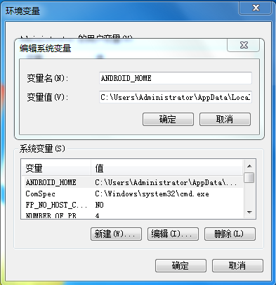

# React Native

## 搭建开发环境

## 安装依赖
> 必须安装的依赖有：Node、React Native 命令行工具、Python2 以及 JDK 和 Android Studio。

注意 Node 的版本必须大于等于 10，Python 的版本必须为 2.x（不支持 3.x），而 JDK 的版本必须是 1.8（目前不支持 1.9 及更高版本）。安装完 Node 后建议设置 npm 镜像以加速后面的过程（或使用科学上网工具）。

注意：不要使用 cnpm！cnpm 安装的模块路径比较奇怪，packager 不能正常识别！
``` js
npm config set registry https://registry.npm.taobao.org --global
npm config set disturl https://npm.taobao.org/dist --global
```
> 官网

[Node](https://www.reactjscn.com/)   
[Python 官网](https://www.python.org/downloads/)   
[Java SE Development Kit (JDK)](https://www.oracle.com/technetwork/java/javase/downloads/jdk8-downloads-2133151.html)   
[Android Studio](https://developer.android.com/studio/index.html)  
[廖雪峰 官网对Python的安装介绍](https://www.liaoxuefeng.com/wiki/897692888725344/897692941155968)
[HAXM （Intel 虚拟硬件加速驱动）](https://github.com/intel/haxm/releases/tag/v7.5.2)   

## Yarn、React Native安装
> Yarn、React Native的命令行工具（react-native-cli）

Yarn是 Facebook 提供的替代 npm 的工具，可以加速 node 模块的下载。React Native 的命令行工具用于执行创建、初始化、更新项目、运行打包服务（packager）等任务。
``` js
// 安装依赖
npm install -g yarn react-native-cli
// yarn设置镜像源
yarn config set registry https://registry.npm.taobao.org --global
yarn config set disturl https://npm.taobao.org/dist --global
```
安装完 yarn 之后就可以用 yarn 代替 npm 了，例如用yarn代替npm install命令，用yarn add 某第三方库名代替npm install 某第三方库名。

## Python安装
> Windows上安装Python：

从Python的[官方网站](https://www.python.org)python.org下载最新的2.7版本，网速慢的同学请移步国内镜像。
特别要注意选上pip和Add python.exe to Path，然后一路点“Next”即可完成安装。

默认会安装到C:\Python27目录下，然后打开命令提示符窗口，敲入python后，看到下面的画面，就说明Python安装成功！：


## JDK安装
从官方网址下载[JDK官网](https://www.oracle.com/technetwork/java/javase/downloads/jdk8-downloads-2133151.html)，出现


安装好之后，然后打开命令提示符窗口，输入“**java -servion**”或者输入“**java**”，如果出现以下界面，就说明JDK安装成功。


## Android 开发环境

译注：请注意！！！国内用户必须必须必须有稳定的翻墙工具，否则在下载、安装、配置过程中会不断遭遇链接超时或断开，无法进行开发工作。某些翻墙工具可能只提供浏览器的代理功能，或只针对特定网站代理等等，请自行研究配置或更换其他软件。总之如果报错中出现有网址，那么 99% 就是无法正常翻墙。

1. **安装 Android Studio**
安装界面中选择"Custom"选项，确保选中了以下几项：
``` sh
● Android SDK
● Android SDK Platform
● Performance (Intel ® HAXM) (AMD 处理器看这里)
● Android Virtual Device
```
然后点击"Next"来安装选中的组件。

> 如果选择框是灰的，你也可以先跳过，稍后再来安装这些组件。

安装完成后，看到欢迎界面时，就可以进行下面的操作了。
2. **安装 Android SDK**
Android Studio 默认会安装最新版本的 Android SDK。目前编译 React Native 应用需要的是Android 9 (Pie)版本的 SDK（注意 SDK 版本不等于终端系统版本，RN 目前支持 android4.1 以上设备）。你可以在 Android Studio 的 SDK Manager 中选择安装各版本的 SDK。

你可以在 Android Studio 的欢迎界面中找到 SDK Manager。点击"Configure"，然后就能看到"SDK Manager"。

在 SDK Manager 中选择"SDK Platforms"选项卡，然后在右下角勾选"Show Package Details"。展开Android 9 (Pie)选项，确保勾选了下面这些组件（重申你必须使用稳定的翻墙工具，否则可能都看不到这个界面）：
``` sh
● Android SDK Platform 28
● Intel x86 Atom_64 System Image（官方模拟器镜像文件，使用非官方模拟器不需要安装此组件）
```
然后点击"SDK Tools"选项卡，同样勾中右下角的"Show Package Details"。展开"Android SDK Build-Tools"选项，确保选中了 React Native 所必须的28.0.3版本。你可以同时安装多个其他版本。

最后点击"Apply"来下载和安装这些组件。

3. **配置 ANDROID_HOME 环境变量**

打开控制面板 -> 系统和安全 -> 系统 -> 高级系统设置 -> 高级 -> 环境变量 -> 新建，创建一个名为ANDROID_HOME的环境变量（系统或用户变量均可），指向你的 Android SDK 所在的目录（具体的路径可能和下图不一致，请自行确认）：



SDK 默认是安装在下面的目录：
``` sh
C:\Users\Administrator\AppData\Local\Android\Sdk
```
你需要关闭现有的命令符提示窗口然后重新打开，这样新的环境变量才能生效。

4. **把 platform-tools 目录添加到环境变量 Path 中**

打开控制面板 -> 系统和安全 -> 系统 -> 高级系统设置 -> 高级 -> 环境变量，选中Path变量，然后点击编辑。点击新建然后把 platform-tools 目录路径添加进去。


此目录的默认路径为：
``` sh
C:\Users\Administrator\AppData\Local\Android\Sdk\platform-tools
```
## 创建新项目
``` js
react-native init AwesomeProject // AwesomeProject为文件名
```
## 使用 Android 模拟器
你可以使用 Android Studio 打开项目下的"android"目录，然后可以使用"AVD Manager"来查看可用的虚拟设备，它的图标看起来像下面这样：
如果你刚刚才安装 Android Studio，那么可能需要先创建一个虚拟设备。点击"Create Virtual Device..."，然后选择所需的设备类型并点击"Next"，然后选择Pie API Level 28 image.
::: warning 注意
如果你还没有安装 HAXM（Intel 虚拟硬件加速驱动），则先点击"Install HAXM"或是按这篇文档说明来进行安装。
:::
然后点击"Next"和"Finish"来完成虚拟设备的创建。现在你应该可以点击虚拟设备旁的绿色三角按钮来启动它了，启动完后我们可以尝试运行应用。

## HAXM安装
官方网址下载最新版本[官网](https://github.com/intel/haxm/releases/tag/v7.5.2)，点击安装。如果出现问题，

解决方法如下：
1. 根据计算机型号，进入BOIS命令（开机按F2、F12、DEL、ESC等键可进入），根据自己电脑型号查询具体进入方式
2. 进入BIOS命令后，找到Configuration选项或者SecurSecurity选项，然后选择Virtualization或者Intel Virtual Technology进入
3. 将其中的unenable改为enable
4. F10保存之前的设置，然后重启计算机