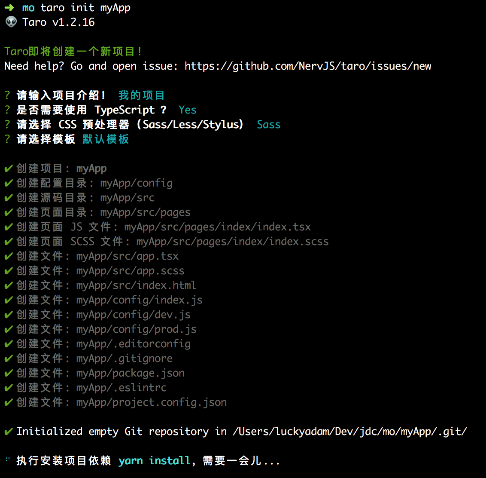

# Taro多端开发

## 简介
Taro 是一套遵循 React 语法规范的 多端开发 解决方案。（[官网](https://taro.aotu.io)）

现如今市面上端的形态多种多样，Web、React-Native、微信小程序等各种端大行其道，当业务要求同时在不同的端都要求有所表现的时候，针对不同的端去编写多套代码的成本显然非常高，这时候只编写一套代码就能够适配到多端的能力就显得极为需要。

使用 Taro，我们可以只书写一套代码，再通过 Taro 的编译工具，将源代码分别编译出可以在不同端（微信/百度/支付宝/字节跳动/QQ小程序、快应用、H5、React-Native 等）运行的代码。

## 安装及使用

### 安装
Taro 项目基于 node，请确保已具备较新的 node 环境（>=8.0.0），推荐使用 node 版本管理工具 nvm 来管理 node，这样不仅可以很方便地切换 node 版本，而且全局安装时候也不用加 sudo 了。

### CLI 工具安装
首先，你需要使用 npm 或者 yarn 全局安装@tarojs/cli，或者直接使用npx:
``` js
// 使用 npm 安装 CLI
$ npm install -g @tarojs/cli
// OR 使用 yarn 安装 CLI
$ yarn global add @tarojs/cli
// OR 安装了 cnpm，使用 cnpm 安装 CLI
$ cnpm install -g @tarojs/cli
// OR 使用 yarn 安装 CLI固定版本
$ yarn global add @tarojs/cli@1.3.9
```
### 项目初始化
使用命令创建模板项目
``` sh
$ taro init myApp
```
命令运行后，会出现如下图所示：


在创建完项目之后，Taro 会默认开始安装项目所需要的依赖，安装使用的工具按照 yarn>cnpm>npm 顺序进行检测，一般来说，依赖安装会比较顺利，但某些情况下可能会安装失败，这时候你可以在项目目录下自己使用安装命令进行安装
``` js
// 使用 yarn 安装依赖
$ yarn
// OR 使用 cnpm 安装依赖
$ cnpm install
// OR 使用 npm 安装依赖
$ npm install
```
进入项目目录开始开发，目前已经支持 微信/百度/支付宝/字节跳动/QQ 小程序、H5、快应用以及 ReactNative 等端的代码转换，针对不同端的启动以及预览、打包方式并不一致。

## 项目运行
### 微信小程序
选择微信小程序模式，需要自行下载并打开微信开发者工具，然后选择项目根目录进行预览。

微信小程序编译预览及打包（去掉 --watch 将不会监听文件修改，并会对代码进行压缩打包）
``` sh
# yarn
$ yarn dev:weapp
$ yarn build:weapp
# npm script
$ npm run dev:weapp
$ npm run build:weapp
# 仅限全局安装
$ taro build --type weapp --watch
$ taro build --type weapp
# npx 用户也可以使用
$ npx taro build --type weapp --watch
$ npx taro build --type weapp
```
### 百度小程序
选择百度小程序模式，需要自行下载并打开百度开发者工具，然后在项目编译完后选择项目根目录下 dist 目录进行预览。

百度小程序编译预览及打包（去掉 --watch 将不会监听文件修改，并会对代码进行压缩打包）
``` sh
# yarn
$ yarn dev:swan
$ yarn build:swan
# npm script
$ npm run dev:swan
$ npm run build:swan
# 仅限全局安装
$ taro build --type swan --watch
$ taro build --type swan
# npx 用户也可以使用
$ npx taro build --type swan --watch
$ npx taro build --type swan
```
### 支付宝小程序
选择支付宝小程序模式，需要自行下载并打开支付宝小程序开发者工具，然后在项目编译完后选择项目根目录下 dist 目录进行预览。

支付宝小程序编译预览及打包（去掉 --watch 将不会监听文件修改，并会对代码进行压缩打包）
``` sh
# yarn
$ yarn dev:alipay
$ yarn build:alipay
# npm script
$ npm run dev:alipay
$ npm run build:alipay
# 仅限全局安装
$ taro build --type alipay --watch
$ taro build --type alipay
# npx 用户也可以使用
$ npx taro build --type alipay --watch
$ npx taro build --type alipay
```
### 字节跳动小程序
选择字节跳动小程序模式，需要自行下载并打开字节跳动小程序开发者工具，然后在项目编译完后选择项目根目录下 dist 目录进行预览。

字节跳动小程序编译预览及打包（去掉 --watch 将不会监听文件修改，并会对代码进行压缩打包）
``` sh
# yarn
$ yarn dev:tt
$ yarn build:tt
# npm script
$ npm run dev:tt
$ npm run build:tt
# 仅限全局安装
$ taro build --type tt --watch
$ taro build --type tt
# npx 用户也可以使用
$ npx taro build --type tt --watch
$ npx taro build --type tt
```
### QQ 小程序
选择 QQ 小程序模式，需要自行下载并打开QQ 小程序开发者工具，然后在项目编译完后选择项目根目录下 dist 目录进行预览。

QQ 小程序编译预览及打包（去掉 --watch 将不会监听文件修改，并会对代码进行压缩打包）
``` sh
# yarn
$ yarn dev:qq
$ yarn build:qq
# npm script
$ npm run dev:qq
$ npm run build:qq
# 仅限全局安装
$ taro build --type qq --watch
$ taro build --type qq
# npx 用户也可以使用
$ npx taro build --type qq --watch
$ npx taro build --type qq
```
### 快应用
选择快应用模式，需要自行下载并打开快应用开发者工具，然后在项目编译完后，在开发者工具中选择「打开文件夹」选择项目根目录下 dist 目录，点击左边的预览图标（那个眼睛图标）进行预览。

快应用编译预览及打包（去掉 --watch 将不会监听文件修改，并会对代码进行压缩打包）
``` sh
# yarn
$ yarn dev:quickapp
$ yarn build:quickapp
# npm script
$ npm run dev:quickapp
$ npm run build:quickapp
# 仅限全局安装
$ taro build --type quickapp --watch
$ taro build --type quickapp
# npx 用户也可以使用
$ npx taro build --type quickapp --watch
$ npx taro build --type quickapp
```
快应用开发者工具如何使用？点击了解

快应用端开发流程

### H5
H5 模式，无需特定的开发者工具，在执行完下述命令之后即可通过浏览器进行预览

H5 预览项目
``` sh
# yarn
$ yarn dev:h5
# npm script
$ npm run dev:h5
# 仅限全局安装
$ taro build --type h5 --watch
# npx 用户也可以使用
$ npx taro build --type h5 --watch
```
H5 打包项目
``` sh
# yarn
$ yarn build:h5
# npm script
$ npm run build:h5
# 仅限全局安装
$ taro build --type h5
# npx 用户也可以使用
$ npx taro build --type h5
```
### React Native
React Native 端运行需执行如下命令，React Native 端相关的运行说明请参见 React Native 教程
``` sh
# yarn
$ yarn dev:rn
# npm script
$ npm run dev:rn
# 仅限全局安装
$ taro build --type rn --watch
# npx 用户也可以使用
$ npx taro build --type rn --watch
```